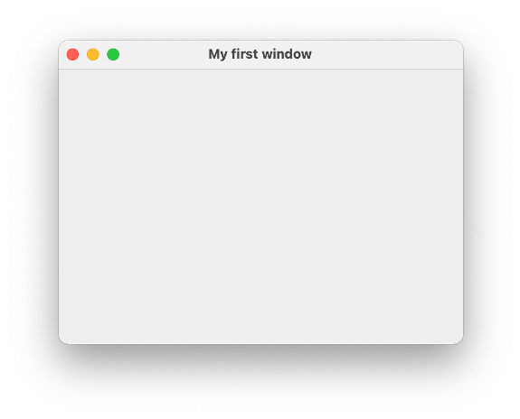

# Graphical User Interfaces

Bis jetzt haben wir unsere Ein- und Ausgaben über die Konsole erledigt oder wir haben Testklassen geschrieben, um Funktionalitäten unserer Programme zu testen. Nun wollen wir grafische Nutzeroberflächen (*Graphical User Interfaces (GUI)*) erstellen, also Fenster, die Steuerelemente enthalten. Steuerelemente sind Ein- und Ausgabeelemente, Labels (also Text), Buttons, Checkboxes, Radiobuttons usw. 

Das Java Developement Kit (JDK) beinhaltet verschiedene Bibliotheken zum Erstellen grafischer Nutzeroberflächen:

- AWT (abstract window toolkit) `java.awt`; alt, aber noch viele Sachen, die man heute noch nutzt: Farben, Listener für Maus und Tastur, Grafiken, ...
- Swing `javax.swing`; das verwenden wir zum Erstellen von Fenstern, auch nicht mehr ganz neu
- JavaFX `javafx`; sollte eigentlich Swing ablösen, hat sich aber nicht durchgesetzt, seit Java 11 nicht mehr Bestandteil des Standard-JDK

Swing ist, wie bereits gesagt, auch nicht mehr neu und wird häufig als veraltet bezeichnet. Allerdings gibt es auch keine Alternativen. JavaFX sollte Swing ablösen, hat sich jedoch noch nicht durchgesetzt. Wir verwenden Swing aus zwei Gründen:

- erstens ist es immernoch das am meisten verwendete Framework für die Erstellung von GUIs in nativen Desktopanwendungen (also alles, was nicht "Web" und was nicht "mobile" ist), bspw. wurde IntelliJ mit Swing aufgebaut und
- zweitens geht es uns um die *Konzepte*, d.h. um den hierarchischen Aufbau der Oberflächen, um Nutzereignisse und die Behandlung dieser. Wir werden uns im 3. Semester in "Webtechnologien" mit der Erstellung moderner Weboberflächen beschäftigen und dabei auf die Grundlagen aufbauen, die wir hier legen. Die Konzepte sind nämlich dieselben. 

### Elemente einer GUI

Eine GUI besteht aus verschiedenen Elementen, deren Zusammenspiel erst die *Benutzbarkeit* der Oberfläche ermöglichen. Unter *Benutzbarkeit* ist dabei die einfache, intuitive und übersichtliche Ein- und Ausgabe von Daten gemeint. Im 6. Semester gibt es eine ganze Lehrveranstaltung zum Thema *Usability* in unserem Studiengang. 


Folgende Elemente sind in einer GUI von Bedeutung:

- Das **Fenster** stellt den äußeren Rahmen einer grafischen Anwendung dar. Es enthält typischerweise einen Rahmen und eine Titelleiste, in der der Name des Fensters bzw. der Anwendung (in der oberen Abbildung `Window`) und drei Buttons zum Schließen des Fensters bzw. der Anwendung (das rote Kreuz in der oberen Abbildung), zum Vollbildmodus (das Quadrat) und zum Verkleinern des Fensters in die Taskleiste (der Unterstrich) enthalten sind. Der Rahmen, genau wie die Titelleiste mit den drei Buttons, sind aber optional. Ein Fenster enthält **Komponenten**.
- **Komponenten** sind alle Oberflächen- bzw. Steuerelemente, d.h. Buttons (siehe oben `< Back` und `Next >`), Labels (Texte, z.B. `Checkbox`), Checkboxes (die Quadrate, die ein Häkchen haben können oder auch nicht), Ein- und Ausgabefelder, Auswahllisten usw. *Steuerlemente* sind also alle Elemente, die direkt der Ein- und Ausgabe dienen. Darüber hinaus gibt es noch die Komponente *Container*. Ein *Container* kann selbst wieder *Container*  enhalten oder *Steuerelemente*. *Container* sind nicht direkt sichtbar, sondern sie dienen der Strukturierung einer grafischen Oberfläche. 
- **Layoutmanager** organisieren die Positionierung von Komponenten. Mithilfe von Layoutmanagern kann man Container unter- und/oder nebeneinander positionieren und organisiert somit die Anordnung der Steuerelmente. 
- **Menüs** sind einblendbare Befehlsleisten. Es gibt die Menüs, die meistens oben in der Menüleiste verankert sind und *Kontextmenüs*, die dort erscheinen, wo man, meistens mit der rechten, Maustaste hinklickt. 
- **Events** (*Ereignisse*) haben zunächst nichts mit der Darstellung selbst zu tun. Sie sind aber für die Benutzbarkeit sehr wichtig, denn jede Nutzeraktion löst ein Ereignis aus, welches wir im programm behandeln können, z.B. Mausklicks, Mausbewegungen, Tastatureingaben, Bewegen, Vergrößern, Verkleinern des Fensters usw. Wir werden uns sehr ausführlich mit der *Behandlung von Ereignissen* beschäftigen.
- **Zeichenoperationen** dienen der Erstellung von Punkten, Linien, Text usw. in Fenstern. Während die Steuerelemente ein festes Aussehen besitzen (anpassbar, je nach Betriebssystem und unterschiedlichen *Look&Feel*-Frameworks), können mit Zeichenoperationen beliebige Elemente erstellt und dargestellt werden, z.B. Grafiken, Kurven oder Diagramme.

Wir werden auf alle diese Elemente eingehen und starten jetzt aber mit unserem ersten Fenster. 

### Ein erstes Fenster mit Swing

Wir erstellen uns eine Klasse `MyFirstWindow`. Von dieser Klasse erzeugen wir uns ein Objekt. Dazu implementieren wir den parameterlosen Konstruktor dieser Klasse. In diesem Konstruktor wird ein `JFrame` erzeugt - das ist das **Fenster** bei Swing. Wir haben in dieser Klasse auch eine `main()`-Methode. das ist nicht ganz sauber, da die `main()`-methode ja eigentlich keine Eigenschaft unserer Klasse ist, deren *Responsibility* die Erstellung eines Fensters ist, aber wir vereinfachen hier zu Anfang:

```java linenums="1"
import javax.swing.JFrame;

public class MyFirstWindow 
{
	
	public MyFirstWindow()
	{
		JFrame window = new JFrame();
		window.setTitle("My first window");
		window.setDefaultCloseOperation(JFrame.EXIT_ON_CLOSE);
		window.setSize(400, 300);
		window.setLocation(300,200);
		window.setVisible(true);
	}

	public static void main(String[] args) 
	{
		new MyFirstWindow();
	}

}
```

Wenn wir diese Klasse ausführen, erscheint folgendes Fenster:



Das Aussehen ist betriebssystemabhängig. Probieren Sie die drei "Knöpfe" in der Titelleiste aus, sie funktionieren bereits, d.h. das Fenster lässt sich in die Taskleiste verkleinern, es lässt sich in den Vollbildmodus umschalten und es kann geschlossen werden (und damit das ganze Programm). Sie können es auch bereits in der Größe verändern. 

Wir betrachten das Programm im Detail:

- In Zeile `8` wird ein Objekt der Klasse `JFrame` erzeugt. Diese Klasse muss aus dem `javax.swing`-Paket importiert werden (Zeile `1`). Sollte der Import bei Ihnen nicht funktionieren, müssen Sie in Ihre `module-info.java` noch `requires java.desktop;` einfügen, um dieses Modul zu laden. Die Klasse `JFrame` repräsentiert ein Fenster im Swing-Paket. Das bedeutet, dass wir, wenn wir in Zukunft eine GUI mithilfe von Swing erstellen, immer damit beginnen, ein Objekt der Klasse `JFrame` zu erzeugen - nämlich ein Fenster. 
- Die Klasse [JFrame](https://docs.oracle.com/en/java/javase/15/docs/api/java.desktop/javax/swing/JFrame.html) stellt eine Unmenge an Objektmethoden zur Verfügung, um das Fenster zu verändern. Viele dieser Methoden sind auch aus Klassen des `java.awt`-Pakets geerbt, z.B. von [Frame](https://docs.oracle.com/en/java/javase/15/docs/api/java.desktop/java/awt/Frame.html), von [Component](https://docs.oracle.com/en/java/javase/15/docs/api/java.desktop/java/awt/Component.html), von [Container](https://docs.oracle.com/en/java/javase/15/docs/api/java.desktop/java/awt/Container.html) oder von [Window](https://docs.oracle.com/en/java/javase/15/docs/api/java.desktop/java/awt/Window.html), aber dazu kommen wir später. Wir wenden einige dieser Methoden bereits an:
- In Zeile `9` setzen wir mithilfe der Objektmethode `setTitle()` einen Titel für unser Fenster, hier `"My first window"`. Um den Titel zu setzen, gibt es auch einen parametrisierten Konstruktor von `JFrame`, dem dieser Titel übergeben werden kann. 
- In Zeile `10` definieren wir, was passieren soll, wenn wir auf den `Schließen`-Buttons des Fensters klicken (also auf das rote Kreuz oder den roten Kreis in der Titelleiste). Mit der statischen Konstanten `EXIT_ON_CLOSE` aus der Klasse `JFrame` legen wir fest, dass sowohl das Fenster geschlossen als auch das Programm beendet werden soll, wenn wir den `Schließen`-Button anklicken. Diese Option ist auch die einzig empfohlene Option für das Schließen des (Haupt-)Fensters. Leider ist sie nicht Standard, so dass wir das immer mitprogrammieren müssen. Sollten Sie diese Anweisung vergessen, so schließt sich zwar das Fenster, nicht jedoch das Programm. 
- In Zeile `11` legen wir die Größe des Fensters in Pixeln fest. Hier wird die Breite mit `400`Pixeln und die Höhe mit `300` Pixeln festgelegt. Die Größe des Fensters ist somit abhängig von der Auflösung Ihres Monitors. Wenn Sie diese Angabe "vergessen", erscheint das Fenster genau so groß, wie es nötig ist, um alle Steuerelemente in dem Fenster darzustellen. Sie würden also nur die drei Knöpfe in der Titelleiste sehen. Diese "minimal erforderliche" Größe eines Fensters erreicht man auch mit der Objektmethode `pack()`, die das Fenster genau so groß darstellt, dass alle Steuerlemente sichtbar sind. 
- In Zeile `12` legen wir fest, *wo* das Fenster auf unserem Monitor erscheint. Die linke obere Ecke des Monitors hat die Koordinaten `(0,0)`. Der erste Parameterwert in `setLocation()` legt fest, wie weit nach *rechts* der linke obere Punkt des Fensters auf unserem Monitor verschoben wird und der zweite Parameterwert legt fest, wie weit nach *unten* der linke obere Punkt des Fensters verschoben wird. Hier verschieben wir also das Fenster um `300` Pixel nach rechts und um `200` Pixel nach unten. Wenn Sie diese Angabe nicht treffen, erscheint das Fenster in der linken oberen Ecke des Monitors. 
- In Zeile `13` setzen wir das Fenster auf *sichtbar*. Diese Anweisung sollten wir nicht vegessen, denn ansonsten sieht man das Fenster nicht und Sie wundern sich. 

### Unsere Klasse ist selbst ein Fenster

Ehe wir weitere Methoden für `JFrame` ausprobieren, ändern wir die Implementierung unserer Klasse leicht. Derzeit haben wir **in** unserer Klasse ein Fenster erzeugt. Nun soll unsere Klasse **selbst** (besser gesagt: ein Objekt unserer Klasse) ein Fenster sein. Dazu lassen wir unsere Klasse von `JFrame` erben:

```java linenums="1" hl_lines="3 8"
import javax.swing.JFrame;

public class MyFirstWindow extends JFrame
{
	
	public MyFirstWindow()
	{
		super();
		this.setTitle("My first window");
		this.setDefaultCloseOperation(JFrame.EXIT_ON_CLOSE);
		this.setSize(400, 300);
		this.setLocation(300,200);
		this.setVisible(true);
	}

	public static void main(String[] args) 
	{
		new MyFirstWindow();
	}

}
```


