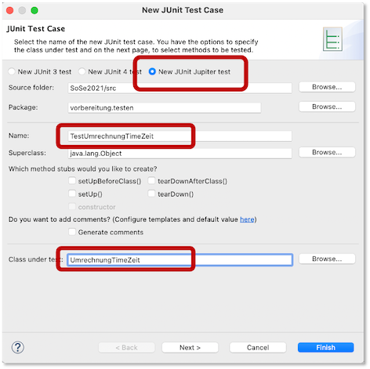

# JUnit-Tests

Testen von Programmen ist wichtig. Ohne Testen ist es kaum möglich, Fehler in Programmen zu entdecken. Bis jetzt haben wir unsere Programme immer durch reines Anwenden getestet, d.h. wir haben die implementierten Methoden aufgerufen und ihnen unterschiedliche Parameterwerte übergeben. Wir werden das jetzt ändern und nutzen dafür [JUnit](https://junit.org/junit5/).

## Allgemeines zum (Unit-)Testen

Der berühmte Informatiker [Edsger W. Dijkstra](https://de.wikipedia.org/wiki/Edsger_W._Dijkstra) hat über das Testen gesagt:

> Durch Testen kann man stets nur die Anwesenheit, nie aber die Abwesenheit von Fehlern beweisen

Das bedeutet, wir können durch das Testen Fehler finden. Wenn wir aber keine finden, dann wissen wir nicht, ob das Programm dann auch keine Fehler mehr enthält. Es ist leider nicht möglich, grundsätzlich die Fehlerfreiheit von Programmen zu prüfen. Aber das Testen stellt ein wichtiges Werkzeug dar, um Fehler zu entdecken. 

Es gibt verschiedene Arten von Tests:


In der Abbildung erkennen wir, dass die Unit-tests, die wir hier kennenlernen wollen, am besten automatisierbar, am häufigsten und am einfachsten sind. Mit Unit-Tests können wir Methoden und Klassen testen, wobei wir die Tests implementieren. Die Idee ist, dass wir funktionale Einzelteile eines Programms separat und isoliert vom Rest auf ihre Korrektheit hin überprüfen. Wir versuchen extra, so wenig wie möglich die Effekte anderer Funktionalitäten bzw. Komponenten in die Tests einfließen zu lassen. Das erfolgt dann in den Komponenten- bzw. Integrationstests. Das hat zwei Vorteile: einerseits ist der zu prüfende Funktionsumfang überschaubar und andererseits können diese Unit-Tests leicht automatisiert ausgeführt werden. Es gibt, wie bereits eingangs erwähnt, keine Garantie von Fehlerfreiheit. Ein Nachteil der Unit-Tests besteht darin, dass sie schwierig für Methoden zu gestalten sind, in denen es Abhängigkeiten von der Laufzeitumgebung oder anderen Komponenten gibt.    

## Test-Driven Development

Unit Tests können entweder nach Erstellung des Programmcodes geschrieben werden, um diesen nachträglich zu testen oder **vor** Erstellung des Programmcodes. Wenn wir die Tests vor der Erstellung des Programmcodes erstellen, dann beschreiben wir mit den Tests die Anforderungen an den zu erstellenden Code. Wir werden hier lernen, wie die Erstellung der Tests und des Programmcodes Hand-in_Hand erfolgen können. Diese Vorgehensweise nennt sich *Test-driven developement (TDD)*. 

Wir werden, wie üblich, TDD anhand eines Beispiels einführen. Unser Vorgehen lässt sich wie folgt beschreiben:

1. Wir schreiben einen Test, der die Anforderung für einen möglichst kleinen iterativen Schritt bei der Erstellung des Programmcodes beschreibt. 
2. Wir schreiben möglichst wenig Programmcode, so dass der Test genau erfüllt wird. 
3. Wir gehen wieder zu 1. und beschreiben den nächsten möglichst kleinen iterativen Schritt durch einen Test.
4. Wir wiederholen 2. für den neuen Test usw. 

Die folgende Abbildung visualisiert das Vorgehen. 


Ausgangspunkt ist immer ein Test. Wir implementieren solange, bis dieser und alle vorher implementierten Tests erfolgreich durchlaufen werden. Dann schreiben wir einen weiteren Test und implementieren wieder so lange, bis dieser und alle vorher geschreibenen Tests erfolgreich durchlaufen werden. Dieses Vorgehen wird so lange wiederholt, so lange wir weitere Testfälle hinzufügen können, die jeweils neue Anforderungen beschreiben. Zur Implementierung des Codes gehört auch das Refactoring, d.h. wir verbessern bisher geschriebenen Code durch neue Tests. 

### TDD für einen Time-Zeit-Umrechner

Angenommen, wir wollen einen einfachen Konverter erstellen, der eine Uhrzeit im 12-Stunden-Zeitsystem (mit `am` und `pm`) in eine 24-Stundendarstellung umwandelt (von `String` nach `String`). Im Web findet man einige Beispiel, z.B. [hier](https://www.timeanddate.de/uhrzeit/am-pm-bedeutung). Dazu erstellen wir uns zunächst eine Klasse `UmrechnungTimeZeit.java`, die die Methode `convert()` enthält. Diese Methode erwartet einen `String` mit einer 12-Stunden-Zeit `time` und gibt einen `String` zurück, der die `time` im 24-Stundenformat darstellt.

=== "UmrechnungTimeZeit.java"
	```java
	public class UmrechnungTimeZeit {
		
		public String convert(String time)
		{
			return "";
		}

	}
	```

Das ist unsere Klasse in der Augangssituation. Bevor wir anfangen, zu implemntieren, wollen wir uns zunächst einen ersten einfachen Test schreiben, der uns eine erste Anforderung (einen ersten Testfall) beschreibt. Dazu wählen wir in Eclipse `File --> New --> JUnit Test Case`. Es erscheint folgendes Fenster: 



Wir wählen `New JUnit Jupiter test` aus und benennen unsere Testklasse `TestUmrechnungTimeZeit` und geben an, dass die `Class under test` die Klasse `UmrechnungTimeZeit` ist (Auswahl durch `Browse...`). Wenn wir dann auf `Finish` klicken, erscheint:


Das bestätigen wir mit `OK`. Es wird die `TestUmrechnungTimeZeit.java` erstellt, die so aussieht:

=== "TestUmrechnungTimeZeit.java"
	```java
	import static org.junit.jupiter.api.Assertions.*;
	import org.junit.jupiter.api.Test;

	class TestUmrechnungTimeZeit {

		@Test
		void test() {
			fail("Not yet implemented");
		}

	}
	```

Sollten Fehler beim Import der `junit.jupiter`-Pakete angezeigt werden, dann müssen Sie in Ihre `module-info.java` noch folgende Anweisung einfügen: 

=== "Einfügen in die module-info.java"
	```java
		requires org.junit.jupiter.api;
	```

### Eine JUnit-Testklasse

Die Klasse `TestUmrechnungTimeZeit.java` ist eine JUnit-Testklasse. Eine JUnit-Testklasse enthält keine `main()`-Methode, ist aber ausführbar. Sie enthält stattdessen Methoden, die mit `@Test` annotiert sind. Diese `@Test`-Methoden enthalten **Zusicherungen** (sogenannte **Assertions**). Mit diesen Assertions geben Sie das erwartete Ergebnis des Testfalls an. 

#### Assertions

Es gibt unterschiedliche Möglichkeiten, das *tatsächliche Ergebnis* der Ausführung mit dem *erwarteten Ergebnis* zu vergleichen:

- Gleichheit, Ungleichheit, kleiner, größer
- `null`, nicht `null`
- gleiche Objekte (`equals()`)

Diese Vergleiche werden mittels Assertions durchgeführt. Folgende Tabelle gibt einen Überblick über einige der am meisten verwendeten Assertions an. Alle Assertions, die es gibt, finden Sie [hier](https://junit.org/junit5/docs/current/api/org.junit.jupiter.api/org/junit/jupiter/api/Assertions.html).

|Assertion |Beschreibung |
|----------|-------------|
|`fail(message)`|Lässt den Test scheitern (fail) mit Nachricht `message`. Wird genutzt, um zu überprüfen, ob Code unerreichbar ist oder bevor der Test implementiert ist. |
|`assertTrue(cond,m)`|Überprüft, ob Bedingung `cond` **wahr** ist oder scheitert mit Nachricht `m` |
|`assertFalse(cond,m)`|Überprüft, ob Bedingung `cond` **false** ist oder scheitert mit Nachricht `m`|
|`assertEquals(a,b,m)`|Überprüft, ob Parameter `a` und `b` **gleich** sind oder scheitert mit Nachricht `m`|
|`assertArrayEquals(a,b,m)` |Überprüft, ob Inhalte der Arrays `a` und `b` **gleich** sind oder scheitert mit Nachricht `m` |
|`assertNull(o,m)` |Überprüft, ob Object `o==null` ist oder scheitert mit Nachricht `m` |
|`assertNotNull(o,m)` |Überprüft, ob Object `o!=null` ist oder scheitert mit Nachricht `m` |
|`assertSame(o1,o2,m)` |Überprüft, ob Objektreferenz `o1==o2` ist oder scheitert mit Nachricht `m`|
|`assertNotSame(o1,o2,m)` |Überprüft, ob Objektreferenz `o1!=o2` ist oder scheitert mit Nachricht `m` |

Derzeit verwenden wir in unserer Testklasse nur die Assertion `fail()`. Diese steht aber nur dafür, dass wir diesen Test noch implementieren müssen. Das machen wir jetzt.

### Eine erste Testmethode für unser Beispiel

Zunächst einmal schauen wir uns an, wie wir unsere Testklasse ausführen. Dazu wählen wir in Eclipse unter `Run --> Run As ... --> JUnit Test`. Oder Sie wählen gleich den mittleren der gezeigten drei Buttons . Dann erhalten Sie folgendes Bild:


Auf der linken Seite sehen Sie im `JUnit`-Reiter einen roten Querbalken. Dieser zeigt an, dass ein Test fehlgeschlagen ist. Im Editor-Fenster wird der fehlgeschlagene Test rot markiert. Es ist klar, dass der Test fehlschlägt, denn das bezweckt ja die Assertion `fail()`. Links unten sieht man den `Failure trace`. Dort ist in der ertsen Zeile die Fehlermeldung `Not yet implemented` zu sehen - das ist die Nachricht, die der `fail()`-Assertion übergeben wurde.

Wir implementieren nun die erste Testmethode. Dazu benennen wir die Methode `test()` um in `testConvert1amTo1()`. In unserem ersten Test wollen wir überprüfen, ob unsere Methode `convert(String time)` korrekt arbeitet, wenn ihr der `String` `1:00 am` übergeben wird. Die Idee ist nun die folgende: wir definieren unsere Testmethode so, dass wir angeben, welches Ergebnis wir erwarten, wenn der String `1:00 am` übergeben wird. Wir erwarten das Ergebnis `1:00`.

Generell sollte eine Testmethode in der folgenden Form aufgebaut sein:

- `given (preperation)`: gibt die Voraussetzungen des Tests an, z.B. die Erzeugung eines Objektes; bei uns: die Erzeugung eines `UmrechnungTimeZeit`-Objektes,
- `when (execution)`: beschreibt, was und wie ausgeführt werden soll; bei uns: die Ausführung der Methode `convert()` mit dem Parameterwert `"1:00 am"`,
- `then (verification)`: beschreibt, wie sich das Ergebnis der Ausführung in Bezug auf das erwartete Ergebnis verhalten soll; bei uns: `assertEquals(tatsaechlichesErgebnis, "1:00")`.

Nach Umbenennung der Methode `test()` in `TestUmrechnungTimeZeit.java` in `testConvert1amTo1(String time)` und Implementierung dieser Methode sieht die Klasse `TestUmrechnungTimeZeit.java` nun so aus:

=== "TestUmrechnungTimeZeit.java"
	```java linenums="1"
	import static org.junit.jupiter.api.Assertions.*;
	import org.junit.jupiter.api.Test;

	class TestUmrechnungTimeZeit {
		
		@Test
		void testConvert1amTo1() {
			// preperation --> given
			UmrechnungTimeZeit utz = new UmrechnungTimeZeit();
			
			// execution --> when
			String zeit = utz.convert("1:00 am");
					
			// verification --> then
			assertEquals(zeit, "1:00");				
		}

	}
	```

In der Testmethode erzeugen wir uns also zunächst ein Objekt von `UmrechnungTimeZeit`, damit wir die Objektmethode `convert()` überhaupt aufrufen können (Zeile `9`). Dann rufen wir die `convert()`-Methode auf und übergeben ihr den String `"1:00 am"`. Das Ergebnis der Methode wird in der Variablen `zeit` gespeichert (Zeile `12`). Dann vergleichen wir das tatsächliche Ergebnis (`zeit`) mit dem erwarteten Ergebnis (`"1:00"`) und wollen, dass beide gleich sind (`assertEquals()`).

Somit haben wir einen möglichst kleinen iterativen Schritt hin zur fertigen Implementierung als Test beschrieben. Unsere nächste Aufgabe ist nun, möglichst wenig Programmcode zu schreiben, so dass der Test genau erfüllt wird. Diese Aufgabe erledigen wir auf ganz simple Weise, indem unsere `convert()`-Methode einfach den String `"1:00"` zurückgibt. 

=== "UmrechnungTimeZeit.java"
	```java liennums="1" hl_lines="5"
	public class UmrechnungTimeZeit {
		
		public String convert(String time)
		{
			return "1:00";
		}

	}
	```

Das erscheint uns auf den ersten Blick völlig sinnlos - und das ist es natürlich irgendwie auch. Aber wir erinnern uns: wir wollen möglichst wenig Programmcode schreiben, so dass der Test genau erfüllt wird. Und das machen wir hier. Wenn wir nun unsere Testklasse ausführen, dann sehen wir:


Auf der linken Seite ist nun ein grüner Balken zu sehen, d.h. alle unsere Tests (bis jetzt haben wir nur einen) sind korrekt. Unsere Methode `convert()` arbeitet in Bezug auf unsere Tests korrekt. 

Nun fügen wir einen zweiten Test hinzu. Dazu können wir die Methode `testConvert1amTo1()` einfach kopieren. Die neue Methode nennen wir `testConvert1amTo1()`, da wir nun testen wollen, ob unsere Methode auch den String `"2:00 am"` korrekt nach `"2:00"` umwandelt. Mit diesem Test beherzigen wir das Prinzip, den nächsten möglichst kleinen iterativen Schritt durch einen Test zu beschreiben. Dieser möglichst kleine Schritt ist für uns der Schritt von `"1:00 am"` nach `"2:00 am"`.

Die neue Testmethode sieht so aus:

=== "TestUmrechnungTimeZeit.java"
	```java linenums="1" hl_lines="18-28"
	import static org.junit.jupiter.api.Assertions.*;
	import org.junit.jupiter.api.Test;

	class TestUmrechnungTimeZeit {
		
		@Test
		void testConvert1amTo1() {
			// preperation --> given
			UmrechnungTimeZeit utz = new UmrechnungTimeZeit();
			
			// execution --> when
			String zeit = utz.convert("1:00 am");
					
			// verification --> then
			assertEquals(zeit, "1:00");				
		}
			
		@Test
		void testConvert2amTo2() {
			// preperation --> given
			UmrechnungTimeZeit utz = new UmrechnungTimeZeit();
			
			// execution --> when
			String zeit = utz.convert("2:00 am");
					
			// verification --> then
			assertEquals(zeit, "2:00");				
		}

	}
	```

Wenn wir die Testklasse nun ausführen, ohne die `convert()`-Methode zu ändern, erhalten wir folgendes Bild:


Der Balken im `JUnit`-Fenster ist rot. Darunter wird uns angegeben, dass der Testfall `testConvert1amTo1()` immer noch korrekt ist (grüner Haken), aber der Testfall `testConvert2amTo2()` ist gescheitert (blaues Kreuz). Im Editorfenster ist rot unterlegt, welche Assertion gescheitert ist (`assertEquals(zeit, "2:00");`). 

Wir brauchen nun also eine Idee, wie wir die `convert()`-Methode anpassen können, so dass beide Testfälle korrekt ausgeführt werden. Wir versuchen es mit der Idee, einfach die ersten vier Zeichen des übergebenen Strings `time` zurückzugeben:

=== "UmrechnungTimeZeit.java"
	```java linenums="1" hl_lines="5"
	public class UmrechnungTimeZeit {
		
		public String convert(String time)
		{
			return time.substring(0,4);
		}

	}
	```

Wenn wir nun unsere Testklasse ausführen, dann sind beide Testfälle korrekt. Auf diese Art und Weise entwickeln wir nach und nach eine Implementierung der `convert()`-Methode. Dazu fügen wir nach und nach immer weitere Testfälle unserer Testklasse hinzu. Mindestens noch für folgende Fälle:

|`time` | erwartetes Ergebnis |
|-------|---------------------|
|`"1:15 am"` |`"1:15"` |
|`"11:00 am"` |`"11:00"` |
|`"11:15 am"` |`"11:15"` |
|`"1:00 pm"` |`"13:00"` |
|`"2:00 pm"` |`"14:00"` |
|`"1:15 pm"` |`"13:15"` |
|`"11:00 pm"` |`"23:00"` |
|`"11:15 pm"` |`"23:15"` |
|`"12:00 am"` |`"0:00"` |
|`"12:01 am"` |`"0:01"` |
|`"12:00 pm"` |`"12:00"` |
|`"12:01 pm"` |`"12:01"` |
|`"12:00 noon"` |`"12:00"` |
|`"12:00 midnight"` |`"0:00"` |

Das Auswahl der Testwerte ist ganz offensichtlich ein wichtiges Thema und bestimmt die Korrektheit der späteren Implementierung mit. Es ist wichtig, keinen Testfall zu vergessen. Leider gibt es dafür keine formalen Regeln, sondern nur intuitive Vorgaben. Es wird immer versucht, "Grenzwerte" zu ermitteln, um wirklich alle Testfälle abzudecken. 

## Annotationen

Neben den Assertions gibt es auch noch *Annotationen*, die beim Testen eine Rolle spielen. Eine Annotation haben wir bereits verwendet: `@Test`. Hier einen Überblick über die häufigsten Annotationen:

<table>
	<thead>
		<tr>
			<th>Annotation </th> 
			<th>Beschreibung </th>
		</tr>
	</thead>
	<tbody>
		<tr>
			<td>
				@Test <br>
				public void method()
			</td>
			<td>
				Die Methode ist eine Testmethode
			</td>
		</tr>
				<tr>
			<td>
				@BeforeEach <br>
				public void method()
			</td>
			<td>
				Die Methode wird vor jedem Test ausgeführt
			</td>
		</tr>
		<tr>
			<td>
				@AfterEach <br>
				public void method()
			</td>
			<td>
				Die Methode wird nach jedem Test ausgeführt
			</td>
		</tr>
		<tr>
			<td>
				@BeforeAll <br>
				public static void method()
			</td>
			<td>
				Die Methode wird einmalig ausgeführt bevor die Tests starten (static!)
			</td>
		</tr>
		<tr>
			<td>
				@AfterAll <br>
				public static void method()
			</td>
			<td>
				Die Methode wird einmalig ausgeführt nachdem die Tests gelaufen sind
			</td>
		</tr>
	</tbody>
</table>

## Ein Beispiel

Wir betrachten die Klasse `Power` mit 

```java linenums="1"
public class Power {
	private int base;
	private int exp;
	
	public Power(int base, int exp)
	{
		this.base = base;
		this.exp = exp;
	}
	
	public double value()
	{
		double value = 1.0;
		if(exp > 0)
		{
			for(int i=0; i<exp; i++)
			{
				value *= base;
			}
		}
		else
		{
			for(int i=0; i<-exp; i++)
			{
				value *= base;
			}
			value = 1.0 / value;
		}
		return value;
	}
	
	@Override
	public String toString()
	{
		return "(" + this.base + "^" + this.exp + ")";
	}
	
	public void print()
	{
		System.out.println(this.toString());
	}
	
	@Override
	public boolean equals(Object o)
	{
		if(o == null) return false;
		if(this == o) return true;
		if(this.getClass() != o.getClass()) return false;
		
		Power p = (Power)o;
		return (this.base==p.base && this.exp==p.exp);
	}
	
	@Override
	public int hashCode()
	{
		return 7*this.base + 11*this.exp; 
	}
}
```

Für diese Klasse erstellen wir eine Testklasse, die neben der Annotation `@Test` auch die Annotationen `@BeforeAll` und `@BeforeEach` exemplarisch verwendet. 

```java linenums="1"
import static org.junit.jupiter.api.Assertions.*;

import org.junit.jupiter.api.BeforeAll;
import org.junit.jupiter.api.BeforeEach;
import org.junit.jupiter.api.Test;

class PowerTest {
	static Power p1,p2,p3,p4;
	static int testnr = 1;

	@BeforeAll
	public static void setup()
	{
		p1 = new Power(2,3);
		p2 = new Power(2,3);
		p3 = new Power(-2,3);
		p4 = new Power(2,-3);
	}
	
	@BeforeEach
	public void printBeforeTests()
	{
		System.out.printf("%n %n --------------- Test %d ------------ %n", testnr);
		p1.print();
		p2.print();
		testnr++;
	}


	@Test
	void testToString() {
		String s = p1.toString();
		
		assertEquals("(2^3)", s, "Strings are not equal!");
	}

	@Test
	void testPower() {
		assertNotNull(p1, "no Power object");
	}

	@Test
	void testValue() {		
		double value = p1.value();
		
		assertEquals(value, 8.0, "2^3 should be 8.0");
	}
	
	@Test
	public void testEqualsObject() {
		assertTrue(p1.equals(p2), " 2^3 should be equal to 2^3!");
	}
}
```

Diese Testklasse deckt natürlich viel zu wenige Testfälle ab, aber es geht hier nur ums Prinzip. Führen Sie die Testklasse aus und beobachten Sie dabei auch die Konsole. Vor jeden Test (`@BeforeEach`) gibt es eine Ausgabe auf die Konsole. Bevor irgendein Test (`@Test`) ausgeführt wird (`@BeforeAll`) werden verschiedene Objekte der Klasse `Power` erzeugt. In den Testfällen werden aber nur `p1` und `p2` verwendet. Das müsste natürlich noch deutlich erweitert werden.

!!! success
	Wir haben JUnit-Testing kennengelernt. Unit-Tests sind eine gute Möglichkeit, einzelne Methoden automatisiert zu testen. Mithilfe von Unit-Tests können wir Code so entwicklen, dass alle formulierten Tests erfolgreich bestehen. Werden erst die Tests geschrieben und gegen die Tests implementiert, wird dieses Programmierverfahren Test-driven development genannt. Unit-Tests können aber auch verwendet werden, um existierenden Code zu testen. JUnit ist das Framework für Java-Unit-Tests. Ausführliche Informationen zu JUnit sind [hier](https://junit.org/junit5/) zu finden.   
