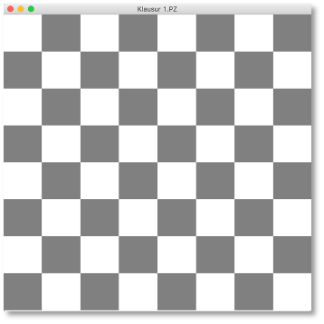
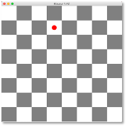
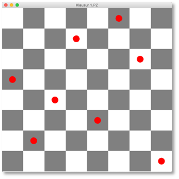
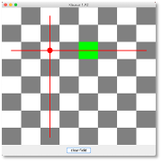

# Klausurvorbereitung

Alle wesentlichen Konzepte, die wir für die Klausur benötigen, haben wir jetzt in diesem und im vergangenen Semester gelernt. Wir wollen diese Kenntnisse nun durch mehrere Anwendungen vertiefen. Ganz vereinzelt wird dabei auch etwas Neues auftauchen. Dabei handelt es sich aber nicht um ein neues Konzept, sondern bspw. um einen Listener, den wir noch nicht hatten. Solche "Überraschungen" werden Sie aber in der Klausur nicht erleben. 

Dieses Kapitel wird hier so aufgebaut sein, dass es immer eine Aufgabe (eine Probeklausur) gibt und die dazugehörige Lösung, die aber "aufgeklappt" werden muss. Sie können ja immer zuerst probieren, die Lösung selbständig zu entwickeln. Wenn Sie am Ende alle Aufgaben selbständig lösen können, sind Sie mit Sicherheit sehr gut auf die Klausur vorbereitet. 

Wir beginnen aber noch kurz mit allgemeinen Betrachtungen zum Grundgerüst. Eines der nachfolgend vorgestellten Grundgerüste werden Sie mit Sicherheit bei der Klausur verwenden können.


### Mögliche Grundgerüste

Wie Sie wissen, ist das Fenster (`JFrame`) im [BorderLayout](../gui/#borderlayout). Das bedeutet, dass das Fenster in fünf Bereiche (`Container`) unterteilt ist. Sie müssen sich bei der Konfiguration überlegen,

- ob "gezeichnet" werden soll, d.h. ob das `JPanel` im `CENTER` des Fensters eine eigene Klasse ist, oder ob es mithilfe einer Methode erzeugt werden kann und
- welche der fündf Bereiche Sie benötigen. 

Wir erläutern das an Beispielen und beginnen mit einem Grundgerüst, welches wir für das Zeichnen verwenden können, welches also eine `Canvas` enthält.

=== "Grundgerüst mit Canvas"
	```java linenums="1"
	import java.awt.BorderLayout;
	import java.awt.Graphics;
	import java.awt.Graphics2D;

	import javax.swing.JFrame;
	import javax.swing.JPanel;

	public class GrundgeruestMitCanvas extends JFrame{
		Canvas canvas;
		
	    public GrundgeruestMitCanvas()
	    {
	        super();
	        this.setTitle("GrundgeruestMitCanvas");
	        this.setDefaultCloseOperation(JFrame.EXIT_ON_CLOSE);    

	        this.canvas = new Canvas();
	        this.getContentPane().add(this.canvas, BorderLayout.CENTER);
	        
	        // von den folgenden vier Zeilen werden eventuell eine oder mehrere oder alle auskommentiert
	        this.getContentPane().add(this.initNorth(), BorderLayout.NORTH);
	        this.getContentPane().add(this.initSouth(), BorderLayout.SOUTH);
	        this.getContentPane().add(this.initEast(), BorderLayout.EAST);
	        this.getContentPane().add(this.initWest(), BorderLayout.WEST);

	        this.setSize(400, 300);
	        this.setLocation(300,200);
	        this.setVisible(true);
	    }

	    private class Canvas extends JPanel
	    {
	        @Override
	        protected void paintComponent(Graphics g)
	        {
	            super.paintComponent(g);        // Implementierung von JPanel aufrufen
	            Graphics2D g2 = (Graphics2D)g;  // Methoden von Graphics2D nutzbar
	            // hier koennen wir zeichnen
	        }
	    }
	    
	    private JPanel initNorth() 
	    {
	    	JPanel north = new JPanel();
	    	// hier das JPanel fuer NORTH befuellen
	    	return north;
	    }
	      
	    private JPanel initSouth() 
	    {
	    	JPanel south = new JPanel();
	    	// hier das JPanel fuer SOUTH befuellen
	    	return south;
	    }
	    
	    
	    private JPanel initEast() 
	    {
	    	JPanel east = new JPanel();
	    	// hier das JPanel fuer EAST befuellen
	    	return east;
	    }
	      
	    private JPanel initWest() 
	    {
	    	JPanel west = new JPanel();
	    	// hier das JPanel fuer WEST befuellen
	    	return west;
	    }

	    public static void main(String[] args) 
	    {
	        new GrundgeruestMitCanvas();
	    }
	}	
	```

In diesem Grundgerüst werden alle fünf Bereiche des Fensters mit `JPanel` befüllt. Das `CENTER` wird mit einem Objekt der Klasse `Canvas` befüllt, welche von `JPanel` erbt. Diese Klasse wird benötigt, um in die `paintComponent()`-Methode zu zeichnen. Sollten Sie z.B. kein Panel im `EAST`- und im `WEST`-Bereich des Fensters benötigen, dann löschen Sie einfach die Zeilen `23` und `24` sowei die beiden Methoden `initEast()` und `initWest()`. 

Ein Grundgerüst **ohne** `Canvas`, also ohne Zeichnen, könnte dann so aussehen:


=== "Grundgerüst ohne Canvas"
	```java linenums="1"
	import java.awt.BorderLayout;

	import javax.swing.JFrame;
	import javax.swing.JPanel;

	public class GrundgeruestOhneCanvas extends JFrame{
		JPanel content;
		
	    public GrundgeruestOhneCanvas()
	    {
	        super();
	        this.setTitle("GrundgeruestMitCanvas");
	        this.setDefaultCloseOperation(JFrame.EXIT_ON_CLOSE);    

	        this.content = this.initCenter();
	        this.getContentPane().add(this.content, BorderLayout.CENTER);
	        
	        // von den folgenden vier Zeilen werden eventuell eine oder mehrere oder alle auskommentiert
	        this.getContentPane().add(this.initNorth(), BorderLayout.NORTH);
	        this.getContentPane().add(this.initSouth(), BorderLayout.SOUTH);
	        this.getContentPane().add(this.initEast(), BorderLayout.EAST);
	        this.getContentPane().add(this.initWest(), BorderLayout.WEST);

	        this.setSize(400, 300);
	        this.setLocation(300,200);
	        this.setVisible(true);
	    }

	    private JPanel initCenter() 
	    {
	    	JPanel center = new JPanel();
	    	// hier das JPanel fuer CENTER befuellen
	    	return center;
	    }
	    
	    private JPanel initNorth() 
	    {
	    	JPanel north = new JPanel();
	    	// hier das JPanel fuer NORTH befuellen
	    	return north;
	    }
	      
	    private JPanel initSouth() 
	    {
	    	JPanel south = new JPanel();
	    	// hier das JPanel fuer SOUTH befuellen
	    	return south;
	    }
	    
	    
	    private JPanel initEast() 
	    {
	    	JPanel east = new JPanel();
	    	// hier das JPanel fuer EAST befuellen
	    	return east;
	    }
	      
	    private JPanel initWest() 
	    {
	    	JPanel west = new JPanel();
	    	// hier das JPanel fuer WEST befuellen
	    	return west;
	    }

	    public static void main(String[] args) 
	    {
	        new GrundgeruestOhneCanvas();
	    }
	}
	```

Beachten Sie, dass `JPanel` ohne Angabe eines LayoutManagers im [FlowLayout](../gui/#flowlayout) sind. Das können Sie [ändern](../gui/#layout-manager) und die einzelnen `JPanel` auch noch [weiter verschachteln](../gui/#verschachteln-von-layout-managern).

Eines dieser beiden Grundgerüste können wir nun stets verwenden. Es muss dann jeweils "nur" noch angepasst werden. Wir beginnen mal mit einer Aufgabe. 

### Schachbrett


1. Schreiben Sie eine Klasse `Schachbrett`, die folgendes Fenster darstellt: 
	
	
 
	- Es werden 8x8 Rechtecke dargestellt – abwechselnd mit grauem und weißem Hintergrund 
	- **bitte beachten:** 
		- die dargestellten Rechtecke sind gezeichnet, es handelt sich nicht um einzelne JPanels!!! (ist für später wichtig) 
		- das 8x8-Feld der Rechtecke füllt die Zeichenfläche *vollständig*, d.h. wenn Sie die Größe des Fensters verändern, passt sich auch das 8x8-Feld entsprechend an

2. Implementieren Sie den `MausListener` so, dass Sie durch Mausklick auf die Zeichenfläche einen ausgefüllten Kreis in das Rechteck malen, in das Sie geklickt haben. 
	
	

	- Die Abbildung zeigt das Schachbrett nach einem Mausklick auf das Rechteck in der 2. Zeile und 4. Spalte.
	- Versuchen Sie, die Kreise möglichst *zentriert* in die Rechtecke zu malen. Eine gute Größe für den Durchmesser der Kreise ist 1/3 der Breite oder Höhe der Rechtecke.

3. Klicken Sie mehrmals mit der Maus, werden entsprechend mehrere Kreise dargestellt. 
	
	


4. Fügen Sie dem Süden des Fensters ein `JPanel` hinzu. Dieses `JPanel` enthält einen `JButton` `'clear field'`. Nach Drücken dieses Buttons werden alle roten Kreise wieder gelöscht. 
	
	


5. Erweitern Sie Ihre Implementierung nun so, dass durch einen Mausklick nicht nur ein roter Kreis gezeichnet wird, sondern auch noch eine horizontale und eine vertikale Linie in der Zeile und der Spalte, in der der Kreis gezeichnet wird. 
	
	

	- in der Zeile und Spalte des Kreises erscheint jeweils mittig eine rote Linie


	

	- Abbildung zeigt Schachbrett nach mehreren Mausklicks
	- Die Linien müssen nicht, wie im Bild dargestellt, in der Mitte der Rechtecke anfangen. Sie können auch komplett durchgezeichnet werden, d.h. vom Beginn bis zum Ende einer Zeile bzw. Spalte.

	
6. Erweitern Sie Ihre Implementierung nun so, dass es nicht mehr möglich ist, dass 2 Kreise in der gleichen Spalte oder in der gleichen Zeile erscheinen. Wenn Sie ein Rechteck anklicken, in dessen Zeile oder Spalte bereits ein anderer Kreis ist, so soll kein neuer Kreis gezeichnet werden, sondern das Rechteck als grünes Rechteck erscheinen. 
	
	

	- In das grüne Rechteck wurde geklickt - es erscheint kein Kreis, da in der Zeile bereits ein Kreis ist – stattdessen ein grünes Rechteck.


	

	- In das grüne Rechteck wurde geklickt - es erscheint kein Kreis, da in der Zeile bereits ein Kreis ist - stattdessen ein grünes Rechteck.
	- Das Rechteck bleibt nur bis zum nächsten Klick markiert (grün).

7. **Zusatzaufgabe:**: Erweitern Sie die Schritte 5 und 6 auch auf die Diagonalen, d.h. es sollen auch die jeweiligen Diagonalen der Punkte eingezeichnet werden und keine zwei Punkte dürfen in der gleichen Diagonalen liegen.


??? "Lösung Schachbrett"

	1. Zuerst überlegen wir uns, welches Grundgerüst wir verwenden und wie wir es anpassen. Wir müssen **zeichnen*, also das Grundgerüst **mit** `Canvas`. Von den Nord-, Süd-, Ost-, West-Bereichen benötigen wir nur den Süden (dort kommt der 'clear field'-Button rein). Also ist das unser Ausgangspunkt: 

		```java linenums="1"
		import java.awt.BorderLayout;
		import java.awt.Graphics;
		import java.awt.Graphics2D;

		import javax.swing.JFrame;
		import javax.swing.JPanel;

		public class Schachbrett extends JFrame{
			Canvas canvas;
			
		    public Schachbrett()
		    {
		        super();
		        this.setTitle("Schachbrett");
		        this.setDefaultCloseOperation(JFrame.EXIT_ON_CLOSE);    

		        this.canvas = new Canvas();
		        this.getContentPane().add(this.canvas, BorderLayout.CENTER);
		        
		        // NORTH, EAST, WEST geloescht
		        this.getContentPane().add(this.initSouth(), BorderLayout.SOUTH);

		        this.setSize(400, 300);
		        this.setLocation(300,200);
		        this.setVisible(true);
		    }

		    private class Canvas extends JPanel
		    {
		        @Override
		        protected void paintComponent(Graphics g)
		        {
		            super.paintComponent(g);        // Implementierung von JPanel aufrufen
		            Graphics2D g2 = (Graphics2D)g;  // Methoden von Graphics2D nutzbar
		            // hier koennen wir zeichnen
		        }
		    }
		    
		    private JPanel initSouth() 
		    {
		    	JPanel south = new JPanel();
		    	// hier das JPanel fuer SOUTH befuellen
		    	return south;
		    }
		    
		    public static void main(String[] args) 
		    {
		        new Schachbrett();
		    }
		}
		```

		Von den `initXXX()`-Methoden benötigen wir auch nur noch `initSouth()`. Die anderen drei sind deshalb gelöscht. 

	2. Jetzt können wir mit dem Zeichnen des Schachbretts beginnen. Dazu könnten wir "einfach" 64 gleich große Rechtecke in die `Canvas` zeichnen. Wir sollten hier aber unbedingt dafür ein *Model*, d.h. eine Datenstruktur erstellen und diese dann in der *View* darstellen. Für eine solche Datenstruktur (für ein *Model*) gibt es drei Gründe:
		- wir wollen später erkennen, in welches Feld geklickt wurde und 
		- wir wollen erkennen können, in welches Feld bereits geklickt wurde und
		- wir wollen erkennen können, welche Felder Nachbarfelder sind.

		Da die Dimensionen hier fest sind (8x8), kann man das in einem (zweidimensionalen) Array erledigen. Als Typ jedes einzelnen Elementes sollte `boolean` genügen - markiert oder nicht markiert. Wenn Sie sich nicht sicher sind, ob zwei Zustände genügen, können Sie auch eine `enum` als Typ verwenden. Wir machen das mal, dann bleibt die Lösung flexibler und wir üben `enum` nochmal. 

		```java linenums="1" hl_lines="10-11 19 32-42"
		import java.awt.BorderLayout;
		import java.awt.Graphics;
		import java.awt.Graphics2D;

		import javax.swing.JFrame;
		import javax.swing.JPanel;

		public class Schachbrett extends JFrame{
			Canvas canvas;
			enum State { MARKIERT, UNMARKIERT };
			State[][] field;
			
		    public Schachbrett()
		    {
		        super();
		        this.setTitle("Schachbrett");
		        this.setDefaultCloseOperation(JFrame.EXIT_ON_CLOSE);    

		        this.initField();
		        
		        this.canvas = new Canvas();
		        this.getContentPane().add(this.canvas, BorderLayout.CENTER);
		        
		        // NORTH, EAST, WEST geloescht
		        this.getContentPane().add(this.initSouth(), BorderLayout.SOUTH);

		        this.setSize(400, 300);
		        this.setLocation(300,200);
		        this.setVisible(true);
		    }
		    
		    private void initField() 
		    {
		    	this.field = new State[8][8];
		    	for(int row=0; row<this.field.length; row++)
		    	{
		    		for(int col=0; col<this.field[row].length; col++)
		        	{
		        		this.field[row][col] = State.UNMARKIERT;
		        	}
		    	}
		    }

		    private class Canvas extends JPanel
		    {
		        @Override
		        protected void paintComponent(Graphics g)
		        {
		            super.paintComponent(g);        // Implementierung von JPanel aufrufen
		            Graphics2D g2 = (Graphics2D)g;  // Methoden von Graphics2D nutzbar
		            // hier koennen wir zeichnen
		        }
		    }
		    
		    private JPanel initSouth() 
		    {
		    	JPanel south = new JPanel();
		    	// hier das JPanel fuer SOUTH befuellen
		    	return south;
		    }
		    
		    public static void main(String[] args) 
		    {
		        new Schachbrett();
		    }
		}
		```

		- Wir hätten das `field` auch im Konstruktor erzeugen und befüllen können, lagern es aber in eine eigene Methode aus und rufen diese im Konstruktor auf. Alles, was wir funktional in eine eigene Methode auslagern können, sollten wir auch auslagern - liest sich viel besser!

	3. Jetzt überlegen wir, wie wir das Schachbrett darstellen (die *View*). Die Darstellung erfolgt am besten mit der `fillRect()`-Methode. Diese erwartet die Koordinaten des linken oberen Punktes und die Breite und die Höhe des Rechtecks. Breite und Höhe ergeben sich aus der Breite und Höhe der `Canvas`, jeweils geteilt durch `8`. Aus der Position des zu zeichnenden Rechtecks in einer Zeile ergibt sich dann der `x`-Wert für den linken oberen Punkt und aus der Position des zu zeichnenden Feldes in der Spalte ergibt sich der `y`-Wert des linken oberen Punktes. Wir ändern nun nur die `paintComponent()`-Methode (die *View*), da es nur um die Darstellung geht:

		```java linenums="44"
	    private class Canvas extends JPanel
	    {
	        @Override
	        protected void paintComponent(Graphics g)
	        {
	            super.paintComponent(g);        // Implementierung von JPanel aufrufen
	            Graphics2D g2 = (Graphics2D)g;  // Methoden von Graphics2D nutzbar
	            
	            int canvasHeight = this.getHeight();
	            int canvasWidth = this.getWidth();
	            int heightRect = canvasHeight / 8;
	            int widthRect = canvasWidth / 8;
	            
	            boolean grey = true;
	        	for(int row=0; row<Schachbrett.this.field.length; row++)
	        	{
	        		int y = row * heightRect;		// y-Wert des linken oberen Punktes
	        		grey = !grey;					// mit gleichen Farbe anfangen, wie aufgehoert
	        		for(int col=0; col<Schachbrett.this.field[row].length; col++)
	            	{
	        			int x = col * widthRect; 	// x-Wert des linken oberen Punktes
	        			
	        			if(grey) {
	        				g2.setColor(Color.LIGHT_GRAY);
	        				grey = false;
	        			} else {
	        				g2.setColor(Color.WHITE);
	        				grey = true;
	        			}
	        			g2.fillRect(x, y, widthRect, heightRect);
	            	}
	        	}
	        }
	    }
		```

		- Wir laufen also durch das `field`-Array und ermitteln für die aktuelle Zeile den `y`-Wert und für die jeweils aktuelle Spalte den `x`-Wert.
		- Damit wir immer zwischen Grau und Weiß umschalten, erstellen wir uns eine boole'sche Variable `grey`, die abwechselnd `true` und `false` wird, je nachdem, ob wir als nächstes ein graues oder ein weißes Feld zeichnen wollen. 
		- Nach jeder Zeile ändert sich die Farbe jedoch nicht (wir fangen in der neuen Zeile mit der gleichen Farbe an, wie wir in der alten Zeile aufgehört haben). Deshalb mussten wir noch die Anweisung in Zeile `61` hinzufügen. 
		- Das Schachbrett wird nun so gezeichnet, wie wir das wollten. Wenn das Fenster vergrößert oder verkleinert wird, dann passen sich die Felder entsprechend an, da wir alles abhängig von der Breite und Höhe der Canvas berechnen. 
		- Wir können aber die Fenstergröße aber gleich etwas quadratischer gestalten (z.B. `this.setSize(400, 400);`).

	4. jetzt kümmern wir uns um die roten Punkte inmitten des Rechtecks, falls wir mit der Maus darauf geklickt haben. Dazu benötigen wir den `MouseListener`, denn es geht um einen Mausklick (also entweder `mouseClicked()` oder `mousePressed()`) und nicht um eine Bewegung der Maus. Wir entscheiden uns für `mouseClicked()` - das ist nun also unser * Controller*. Wir implementieren zunächst den `MouseListener` und prüfen, ob damit alles funktioniert (ob wir z.B. nicht vergessen haben, an den `MouseListener` anzumelden.)

		```java linenums="1" hl_lines="5-6 11 25 95-100"
		import java.awt.BorderLayout;
		import java.awt.Color;
		import java.awt.Graphics;
		import java.awt.Graphics2D;
		import java.awt.event.MouseEvent;
		import java.awt.event.MouseListener;

		import javax.swing.JFrame;
		import javax.swing.JPanel;

		public class Schachbrett extends JFrame implements MouseListener{
			Canvas canvas;
			enum State { MARKIERT, UNMARKIERT };
			State[][] field;
			
		    public Schachbrett()
		    {
		        super();
		        this.setTitle("Schachbrett");
		        this.setDefaultCloseOperation(JFrame.EXIT_ON_CLOSE);    

		        this.initField();
		        
		        this.canvas = new Canvas();
		        this.canvas.addMouseListener(this);
		        this.getContentPane().add(this.canvas, BorderLayout.CENTER);
		        
		        // NORTH, EAST, WEST geloescht
		        this.getContentPane().add(this.initSouth(), BorderLayout.SOUTH);

		        this.setSize(400, 400);
		        this.setLocation(300,200);
		        this.setVisible(true);
		    }
		    
		    private void initField() 
		    {
		    	this.field = new State[8][8];
		    	for(int row=0; row<this.field.length; row++)
		    	{
		    		for(int col=0; col<this.field[row].length; col++)
		        	{
		        		this.field[row][col] = State.UNMARKIERT;
		        	}
		    	}
		    }

		    private class Canvas extends JPanel
		    {
		        @Override
		        protected void paintComponent(Graphics g)
		        {
		            super.paintComponent(g);        // Implementierung von JPanel aufrufen
		            Graphics2D g2 = (Graphics2D)g;  // Methoden von Graphics2D nutzbar
		            
		            int canvasHeight = this.getHeight();
		            int canvasWidth = this.getWidth();
		            int heightRect = canvasHeight / 8;
		            int widthRect = canvasWidth / 8;
		            
		            boolean grey = true;
		        	for(int row=0; row<Schachbrett.this.field.length; row++)
		        	{
		        		int y = row * heightRect;		// y-Wert des linken oberen Punktes
		        		grey = !grey;					// mit einer anderen Farbe anfangen, als aufgehoert
		        		for(int col=0; col<Schachbrett.this.field[row].length; col++)
		            	{
		        			int x = col * widthRect; 	// x-Wert des linken oberen Punktes
		        			
		        			if(grey) {
		        				g2.setColor(Color.LIGHT_GRAY);
		        				grey = false;
		        			} else {
		        				g2.setColor(Color.WHITE);
		        				grey = true;
		        			}
		        			g2.fillRect(x, y, widthRect, heightRect);
		            	}
		        	}
		        }
		    }
		    
		    private JPanel initSouth() 
		    {
		    	JPanel south = new JPanel();
		    	// hier das JPanel fuer SOUTH befuellen
		    	return south;
		    }
		    
		    public static void main(String[] args) 
		    {
		        new Schachbrett();
		    }

			@Override
			public void mouseClicked(MouseEvent e) {
				int x = e.getX();
				int y = e.getY();
				System.out.println("mouseClicked: [x=" + x + ", " + y + "]");	
			}

			@Override public void mousePressed(MouseEvent e) {}
			@Override public void mouseReleased(MouseEvent e) {}
			@Override public void mouseEntered(MouseEvent e) {}
			@Override public void mouseExited(MouseEvent e) {}
		}
		```


		- Wir fügen das `implements MouseListener` im Klassenkopf ein und importieren den `MouseListener` aus dem `java.awt.event`-Paket (lassen wir natürlich Eclipse erledigen). 
		- Wir lassen Eclipse durch `Add unimplemented methods` die Methoden aus dem `MouseListener` hinzufügen. Dabei wird auch `MouseEvent` importiert. 
		- Da wir uns für die Implementierung von `mouseClicked()` entschieden haben, können wir die anderen Methoden ein wenig verkleinern, um Übersicht zu bewahren. 
		- In `mouseClicked()` können wir schonmal die Koordinaten des `MouseEvent` abfragen und eine Ausgabe auf die Konsole durchführen, um zu kontrollieren, ob alles funktioniert.
		- **Unbedingt** müssen wir natürlich `canvas` an den `MouseListener` anmelden (Zeile `25`). 
		- `mouseClicked()` wird aufgerufen, wenn wir in das Feld klicken - die Koordinaten des Klicks in die `Canvas` werden auf der Konsole ausgegeben. 

	5. Nun müssten wir uns überlegen, auf welches Rechteck aus dem `field`-Array wir durch die Mausklick geklickt haben. Dieses Rechteck wollen wir als `MARKIERT` speichern. 


