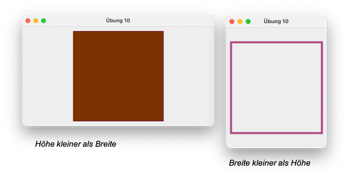

# Übungen

##### Übung 1 (Git)

??? "Übung 1"

	1. Erstellen Sie sich einen GitHub-Account (oder wählen Sie einen anderen Git-Diensteanbieter)
	2. Erstellen Sie sich dort ein zentrales Repository 
	3. Richten Sie Ihren `workspace`, in dem Sie alle Ihre Entwicklungen in diesem Semester durchführen wollen (Übungen, Aufgaben, ...) als lokales Git-Repository ein
	4. Synchroniseren Sie Ihr lokales und Ihr zentrales Git-Repository


??? question "Video zu Übung 1 ([**Git**](../git/#git))"

	<iframe src="https://mediathek.htw-berlin.de/media/embed?key=5db6028a0361a277e7cff404504dd3e4&width=720&height=389&autoplay=false&autolightsoff=false&loop=false&chapters=false&related=false&responsive=false&t=0" data-src="" class="iframeLoaded" width="720" height="389" frameborder="0" allowfullscreen="allowfullscreen" allowtransparency="true" scrolling="no"></iframe>
	- alles zu [EGit](../git/#egit-git-mit-eclipse) herausgenommen

##### Übung 2 (enum und zweidimensionale Arrays)

??? "Übung 2"

	1. Gegeben ist die folgende Klasse `TicTacToe`:

		```java linenums="1"
		package uebungen.uebung2;

		public class TicTacToe 
		{
			enum State {EMPTY, RED, BLACK};
			State[][] field;

			public TicTacToe()
			{
				field = new State[3][3];
				for(int i=0; i<field.length; i++)
				  for(int j=0; j<field[i].length; j++)
				  	field[i][j]=State.EMPTY;
			}

			public void makeMove(int i, int j, State player)
			{
				if(field[i][j]==State.EMPTY && player!=State.EMPTY)   
					field[i][j]=player;
			}
		}
		```
	
	2. Fügen Sie alle notwendigen Klammern `{ }` ein, so dass die Anweisungsblöcke korrekt geklammert sind. 
	3. Erweitern Sie die Klasse `TicTacToe` um eine `print()`-Methode, die das Spielfeld auf die Konsole ausgibt (Setzen Sie z.B. für den Player `RED` ein `x` und für den Player `Black` ein `o` und für `EMPTY` ein Leerzeichen oder ein `-`). Die Ausgabe nach jeweils 2 Zügen von `RED` und `BLACK` könnte dann z.B. so aussehen: 

		```bash
		- o o 
		- x - 
		- - x 
		```

	4. Erweitern Sie die Klasse `TicTacToe` um eine `gewonnen()`-Methode (`true`, wenn ein Spieler drei Felder horizontal, diagonal oder vertikal belegt hat; ansonsten `false`).
	5. Erweitern Sie die Klasse `TicTacToe` um eine `unentschieden()`-Methode (`true`, wenn alle Felder besetzt sind, aber kein Spieler gewonnen hat; ansonsten `false`).
	6. Erstellen Sie eine Test-Klasse mit `main()`-Methode. Erstellen sie darin ein Objekt der Klasse `TicTacToe`. Führen Sie Züge aus (`makeMove()`) und prüfen Sie, ob gewonnen wurde oder unentschieden ist (mit entsprechenden Ausgaben). 
	7. Für 6. müssen Sie in der Testklasse Ihr `enum State` importieren. Warum ist das so? Was könnten Sie machen, damit das nicht notwendig ist?

	8. *Zusatz:* Sie können die Klasse `TicTacToe` beliebig erweitern, z.B.:
		- um Ausgaben, wenn gewonnen bzw. es unentschieden ist,
		- um Fehler in den Indizes `i` und `j` bei der `makeMove()`-Methode abzufangen,
		- eine Methode `spielen()` implementieren, die zufällig für die Spieler die Steine setzt usw.

	**Viel Spaß!**

??? question "Video zu Übung 2 (TicTacToe)"

	<iframe src="https://mediathek.htw-berlin.de/media/embed?key=a8ecee0fb66531428448ec96de483acc&width=720&height=389&autoplay=false&autolightsoff=false&loop=false&chapters=false&related=false&responsive=false&t=0" data-src="" class="iframeLoaded" width="720" height="389" frameborder="0" allowfullscreen="allowfullscreen" allowtransparency="true" scrolling="no"></iframe>


??? question "mögliche Lösung für Übung 2"
	
	=== "TicTacToe.java"
		```java linenums="1"
		package uebungen.uebung2;

		import java.util.Random;

		public class TicTacToe 
		{

			State[][] field;

			public TicTacToe()
			{
				this.field = new State[3][3];
				for(int i=0; i<this.field.length; i++)
				{
					for(int j=0; j<this.field[i].length; j++)
					{
						field[i][j]=State.EMPTY;
					}
				}
			}

			public void makeMove(int row, int col, State player)
			{
				if(row>=0 && row<this.field.length 
						&& col>=0 && col<this.field[row].length 
						&& this.field[row][col] == State.EMPTY)
				{
					if(player!=State.EMPTY) 
					{
						this.field[row][col]=player;
					}
				}
			}

			public void print()
			{
				for(int row=0; row<this.field.length; row++)
				{
					for(int col=0; col<this.field[row].length; col++)
					{
						if(field[row][col]==State.EMPTY)
						{
							System.out.print("- ");
						}
						else if(field[row][col]==State.RED)
						{
							System.out.print("x ");
						}
						else // BLACK
						{
							System.out.print("o ");
						}
					}
					System.out.println();
				}
				System.out.println();
			}
			
			public boolean gewonnen(State player)
			{
				if(player == State.EMPTY) return false;
				
				// alle drei Zeilen pruefen
				for(int row=0; row<this.field.length; row++)
				{
					if(this.field[row][0] == player && this.field[row][1] == player && this.field[row][2] == player)
					{
						return true;
					}
				}
				
				// alle drei Spalten pruefen
				for(int col=0; col<this.field.length; col++)
				{
					if(this.field[0][col] == player && this.field[1][col] == player && this.field[2][col] == player)
					{
						return true;
					}
				}
				
				// Diagonale von links oben nach rechts unten
				if(this.field[0][0] == player && this.field[1][1] == player && this.field[2][2] == player)
				{
					return true;
				}
				
				// Diagonale von rechts oben nach links unten
				if(this.field[0][2] == player && this.field[1][1] == player && this.field[2][0] == player)
				{
					return true;
				}
				return false;
			}
			
			public void printResultat()
			{
				if(this.gewonnen(State.RED))
				{
					System.out.println("Rot hat gewonnen!!!");
				}
				else if(this.gewonnen(State.BLACK))
				{
					System.out.println("Schwarz hat gewonnen!!!");
				}
				else if(this.unentschieden())
				{
					System.out.println("Unentschieden!!!");
				}
			}
			
			public void makeRandomMove(State player)
			{
				if(player != State.EMPTY)
				{
					Random r = new Random();
					int row = r.nextInt(3);
					int col = r.nextInt(3);
					while(this.field[row][col]!=State.EMPTY)
					{
						row = r.nextInt(3);
						col = r.nextInt(3);
					}
					this.field[row][col]=player;
				}
			}
			
			public void spielen()
			{
				State player = State.RED;
				while(!(this.unentschieden() || this.gewonnen(State.RED) || this.gewonnen(State.BLACK)))
				{
					this.makeRandomMove(player);
					this.print();
					this.printResultat();
					if(player == State.RED)
					{
						player = State.BLACK;
					}
					else
					{
						player = State.RED;
					}
					
					// player = (player == State.RED) ? State.BLACK : State.RED;
				}
			}
			
			public boolean voll()
			{
				for(int row=0; row<this.field.length; row++)
				{
					for(int col=0; col<this.field[row].length; col++)
					{
						if(field[row][col]==State.EMPTY)
						{
							return false;
						}
					}
				}
				return true;
			}
			
			public boolean unentschieden()
			{
				return (this.voll() && !this.gewonnen(State.RED) && !this.gewonnen(State.BLACK));
			}
		}
		```

	=== "State.java"
		```java linenums="1"
		package uebungen.uebung2;

		public enum State {
			EMPTY, RED, BLACK
		}
		```
	
	=== "TestTicTacToe.java"
		```java linenums="1"
		package uebungen.uebung2;

		public class TestTicTacToe {

			public static void main(String[] args) 
			{
				TicTacToe ttt = new TicTacToe();
				ttt.print();
				/*
				ttt.makeMove(1, 1, State.RED);
				ttt.printResultat();
				ttt.print();
				ttt.makeMove(1, 2, State.BLACK);
				ttt.printResultat();
				ttt.print();
				ttt.makeMove(1, -1, State.BLACK);
				ttt.printResultat();
				ttt.print();
				ttt.makeMove(0, 1, State.RED);
				ttt.printResultat();
				ttt.print();
				ttt.makeMove(2, 1, State.BLACK);
				ttt.printResultat();
				ttt.print();
				ttt.makeMove(1, 0, State.RED);
				ttt.printResultat();
				ttt.print();
				ttt.makeMove(0, 0, State.BLACK);
				ttt.printResultat();
				ttt.print();
				ttt.makeMove(0, 2, State.RED);
				ttt.printResultat();
				ttt.print();
				ttt.makeMove(2, 0, State.BLACK);
				ttt.printResultat();
				ttt.print();
				ttt.makeMove(2, 2, State.RED);
				ttt.printResultat();
				ttt.print();
				*/
				ttt.spielen();
				// ttt.makeRandomMove(State.RED);
				// ttt.print();
			}

		}

		```


##### Übung 3 (Exceptions)

??? "Übung 3"

	1. Schreiben Sie ein Programm zur Eingabe von zwei Zahlen mithilfe der Klasse `JOptionPane` aus dem und deren Division! Fangen Sie folgende Ausnahmen ab:
		- Falls die Eingabe keiner Zahl entspricht.
		- Falls die zweite Zahl eine 0 ist.

	2. **Scenario**:
		- Fenster zur Eingabe von Zahl 1 öffnet sich: <br/>
			
		- falsche Eingabe - keine Zahl:  <br/>
			
		- Fenster öffnet sich erneut (andere Nachricht!):  <br/>
			
		- Fenster zur Eingabe von Zahl 2 öffnet sich:  <br/>
			
		- die Division Zahl1/Zahl2 schlägt fehl (`ArithmeticException`), deshalb (andere Nachricht!):  <br/>
			
		- Ergebnis  <br/>
			

	3. Lagern Sie eine solche Eingabemöglichkeit in eine wiederverwendbare Methode aus, z.B. `public int inputInt(int min, int max)`, welche die eingegebene Zahl zurückgibt, wobei die eingegebene Zahl im Bereich `[min, max]` liegen muss.

	4. Lesen Sie eine Anzahl von Sekunden ein und schreiben Sie eine Umrechnung, so dass folgende Ausgabe entsteht (die Eingabe ist hier über die Konsole gezeigt) :
		```bash
		Gib eine Anzahl von Sekunden ein: 3456789
		3456789 Sekunden sind 40 Tage, 13 Minuten, 9 Sekunden.
		```

		```bash
		Gib eine Anzahl von Sekunden ein: 2345678
		2345678 Sekunden sind 27 Tage, 3 Stunden, 34 Minuten, 38 Sekunden.
		```

		```bash
		Gib eine Anzahl von Sekunden ein: 123456
		123456 Sekunden sind 1 Tag, 10 Stunden, 17 Minuten, 36 Sekunden.
		```

		```bash
		Gib eine Anzahl von Sekunden ein: 12345
		12345 Sekunden sind 3 Stunden, 25 Minuten, 45 Sekunden.		
		```

	5. Lesen Sie eine Zahl ein und geben Sie die Quersumme der Zahl aus.


	**Viel Spaß!**

??? question "Video zu Übung 3 (Exceptions)"

	<iframe src="https://mediathek.htw-berlin.de/media/embed?key=b18e9318e77865ab2f923c454a28886a&width=720&height=450&autoplay=false&autolightsoff=false&loop=false&chapters=false&related=false&responsive=false&t=0" data-src="" class="iframeLoaded" width="720" height="450" frameborder="0" allowfullscreen="allowfullscreen" allowtransparency="true" scrolling="no"></iframe>


??? question "mögliche Lösung für Übung 3"
	
	=== "Uebung3.java"
		```java linenums="1"
		package uebungen.uebung3;

		import javax.swing.JOptionPane;

		public class Uebung3 
		{
			public static int inputInt(int min, int max, String message)
			{
				boolean eingabeOk = false;
				int zahl = 0;
				// String message = "Geben Sie eine Zahl ein : ";
				while(!eingabeOk)
				{
					String eingabe1 = JOptionPane.showInputDialog(message);

					try {
						zahl = Integer.valueOf(eingabe1);
						if(zahl>=min && zahl<=max)
						{
							eingabeOk = true;
						}
						else
						{
							message = "Zahl muss zwischen " + min + " und " + max + " liegen!";
						}
					} 
					catch (NumberFormatException e) {
						message = "Eingabe war keine Zahl! Bitte Zahl eingeben";
					}
				}
				return zahl;
			}
			
			public static int inputInt(String message)
			{
				return inputInt(Integer.MIN_VALUE,Integer.MAX_VALUE, message);
			}
			
			public static int division(int divident, int divisor) throws ArithmeticException
			{
				int quotient = divident / divisor;
				return quotient;
			}
			
			public static void printDivision()
			{
				int zahl1 = inputInt("Geben Sie eine Zahl1 ein : ");
				boolean zahl2NotZero = false;
				String message = "Geben Sie eine Zahl2 ein : ";
				while(!zahl2NotZero)
				{
					int zahl2 = inputInt(message);
					int result = 0;
					try {
						result = division(zahl1, zahl2);
						zahl2NotZero = true;
					} catch (ArithmeticException e) {
						message = "Zahl2 darf nicht 0 sein!";
					}
					System.out.println(zahl1 + " / " + zahl2 + " = " + result);
				}
			}
			
			public static int quersumme(int zahl)
			{
				int ganz = zahl;
				int quersumme = 0;
				while(ganz>0)
				{
					int rest = ganz % 10;
					quersumme += rest;
					ganz = ganz / 10;
				}
				return quersumme;
			}
			
			public static void printUmrechnungSek()
			{
				int sek = inputInt("Anzahl Sekunden : ");
				int tage 	 = sek/(24*60*60);
				int stunden  = sek/(60*60) 	- (tage*24);
				int minuten  = sek/(60) 	- (tage*24*60) 		- (stunden*60);
				int sekunden = sek 			- (tage*24*60*60) 	- (stunden*60*60) - (minuten*60);
				
				String s = sek + " Sekunden sind ";
				if(tage>1) 	s += tage +" Tage, ";
				else if(tage==1) s+= "1 Tag, ";
				if(stunden>1) s += stunden +" Stunden, ";
				else if(stunden==1) s += "1 Stunden, ";
				if(minuten>1) s += minuten + " Minuten, ";
				else if(minuten==1) s += "1 Minute, ";
				if(sekunden>1) s += sekunden +" Sekunden.";
				else if(sekunden==1) s += "1 Sekunde.";
				System.out.println(s);
			}

			public static void main(String[] args) 
			{
				printDivision();
				int zahl = inputInt("Geben Sie eine Zahl ein");
				// System.out.println("Quersumme von " + zahl + " ist " + quersumme(zahl));
				JOptionPane.showMessageDialog(null, "Quersumme von " + zahl + " ist " + quersumme(zahl));
				
				printUmrechnungSek();
			}
		}
		```

	=== "module-info.java"
		```java linenums="1"		
		module SoSe2021 {
			requires java.desktop;
		}
		```


##### Übung 4 (Test-driven development)

!!! warning

	Diese Übung lassen wir weg. Am 6.5.2021 machen wir stattdessen gleich [Übung 5](./#ubung-5-listen-und-mengen). Das hat den Vorteil, dass wir den Stoff von Vorlesung und Übung wieder zeitlich dichter zusammenziehen (Mittwoch Vorlesung und Donnerstag dazugehörige Übung). Außerdem fällt die Übung am 13.5. wegen des Feiertages weg und somit wäre die Lücke noch größer.

??? "Übung 4"

	1. Implementieren Sie eine Methode `public static int strStr(String haystack, String needle)` durch testgetriebene Entwicklung. Die Methode gibt den Anfangsindex des ersten Auftretens von `needle` in `haystack` aus, z.B. 
	```bash
	// Beispiel 1
	Input: haystack = "hello", needle = "ll"
	Output: 2		// ll beginnt am Index 2

	// Beispiel 2
	Input: haystack = "aaaaa", needle = "bba"
	Output: -1		// bba kommt nicht vor 

	// Beispiel 3
	Input: haystack = "", needle = ""
	Output: 0		// "leerer" String ueberall, also auch bei 0
	```
	Wenn `needle` nicht in `haystack` enthalten ist, wird `-1` zurückgegeben. 

	2. Implementieren Sie eine Methode `public static int[][] permutations(int[] nums)` durch testgetriebene Entwicklung. Die Methode gibt ein Array von `int`-Arrays zurück, welches alle Permutationen der Zahlen aus `nums` enthält, z.B. 
	```bash
	// Beispiel 1
	Input: nums = [1,2,3]
	Output: [[1,2,3],[1,3,2],[2,1,3],[2,3,1],[3,1,2],[3,2,1]]

	// Beispiel 2
	Input: nums = [0,1]
	Output: [[0,1],[1,0]]

	// Beispiel 3
	Input: nums = [1]
	Output: [[1]]
	```
	Sie dürfen folgende Annahmen treffen: 
		- `1 <= nums.length <= 6`
		- `-10 <= nums[i] <= 10`
		- `nums` enthält keine Doppelungen
	
	**Viel Spaß!**


##### Übung 5 (Listen und Mengen)

??? "Übung 5"

	1. Erstellen Sie eine Klasse `Uebung5` mit `main()`-Methode.
	2. Definieren Sie in der `main()`-Methode eine Variable `words` vom Typ `String[]` und weisen Sie dieser Variablen folgende Werte zu:
		```java
		String[] words = {"Linux", "Apple", "Facebook", "Amazon", "IBM", "Lenovo", "Google", "IBM", "Microsoft", "Apple", "Google", "Twitter", "Skype", "Chrome", "Linux", "Firefox"};
		```

	**A. Listen (`List`)**

	1. Erstellen Sie eine Methode `public static List<String> createArrayList(String[] words)`. In dieser Methode soll eine `ArrayList` erstellt werden. Alle Elemente in dieser Liste sind vom Typ `String`. Befüllen Sie diese Liste mit allen Wörtern aus dem `words`-Array. Die Methode gibt die befüllte Liste (`List`) zurück. 
	2. Erstellen Sie eine Methode `public static void printList(List<String> list)`. Diese Methode gibt alle Elemente der Liste `list` auf der Konsole aus. Geben Sie auch die Anzahl der Elemente der Liste aus. 
	3. Erstellen Sie in der `main()`-Methode mithilfe der Methode `createArrayList(words)` eine Liste und speichern Sie diese Liste in einer Variablen vom Typ `List<String>`. Geben Sie alle Elemente dieser Liste mithilfe der Methode `printList()` auf der Konsole aus. 
	4. Studieren Sie alle Methoden für `List` unter [https://docs.oracle.com/en/java/javase/11/docs/api/java.base/java/util/List.html](https://docs.oracle.com/en/java/javase/11/docs/api/java.base/java/util/List.html).

		- Ermitteln Sie den Index in der Liste, in der `"Apple"` das **erste** Mal auftaucht. Erzeugen Sie folgende Ausgabe: 
			```bash
			Index des ersten Auftretens von Apple  : 1
			```

		- Ermitteln Sie den Index in der Liste, in der `"Apple"` das **letzte** Mal auftaucht. Erzeugen Sie folgende Ausgabe: 
			```bash
			Index des letzten Auftretens von Apple : 9
			```

		- Geben Sie den Wert des **ersten** Elementes der Liste aus. Erzeugen Sie folgende Ausgabe: 
			```bash
			erstes Element der Liste : Linux
			```	

		- Geben Sie den Wert des **letzten** Elementes der Liste aus. Erzeugen Sie folgende Ausgabe: 
			```bash
			letztes Element der Liste : Firefox
			```	

		- Löschen Sie die Werte `"Apple"`, `"Google"` und `"Facebook"`. Geben Sie die Liste erneut mithilfe der `printList(list)`-Methode aus.

	**B. Mengen (`Set`)**

	1. Erstellen Sie eine Methode `public static Set<String> createHashSet(String[] words)`. In dieser Methode soll eine `HashSet` erstellt werden. Alle Elemente in dieser Liste sind vom Typ `String`. Befüllen Sie diese Liste mit allen Wörtern aus dem `words`-Array. Die Methode gibt die befüllte Menge (`Set`) zurück. 
	2. Erstellen Sie eine Methode `public static void printSet(Set<String> set)`. Diese Methode gibt alle Elemente der Menge `set` auf der Konsole aus. Geben Sie auch die Anzahl der Elemente der Menge aus. 
	3. Erstellen Sie in der `main()`-Methode mithilfe der Methode `createHashSet(words)` eine Menge und speichern Sie diese Menge in einer Variablen vom Typ `Set<String>`. Geben Sie alle Elemente dieser Menge mithilfe der Methode `printSet()` auf der Konsole aus. Was beobachten Sie in Bezug auf die Anzahl der Elemente im Vergleich zur Anzahl der Elemente in der Liste? Warum ist das so?
	4. Erstellen Sie eine Methode `public static Set<String> createTreeSet(String[] words)`. In dieser Methode soll eine `TreeSet` erstellt werden. Alle Elemente in dieser Liste sind vom Typ `String`. Befüllen Sie diese Menge (`Set`) mit allen Wörtern aus dem `words`-Array. Die Methode gibt die befüllte Menge (`Set`) zurück. 
	5. Erstellen Sie in der `main()`-Methode mithilfe der Methode `createTreeSet(words)` eine Menge und speichern Sie diese Menge in einer Variablen. Geben Sie alle Elemente dieser Menge mithilfe der Methode `printSet()` auf der Konsole aus. Was beobachten Sie in Bezug auf die Sortierung der Elemente im Vergleich zur `HashSet`?

	**Zusatz**

	1. Erstellen Sie für die Liste eine Methode `public static List<String> findDoublets(List<String> list)`. Diese Methode erstellt eine Liste, in der alle Elemente enthalten sind, die in `list` doppelt vorkommen. Diese Elemente werden dann auch doppelt in die Resultat-Liste übernommen. Geben Sie diese Liste mithilfe der `printList()`-Methode in der `main()`-Methode aus.

	??? "Mögliche Ausgabe (je nach Reihenfolge des Aufrufs der Methoden)"

		```bash
		Liste mit 16 Elementen :
		--------------------------
		Linux
		Apple
		Facebook
		Amazon
		IBM
		Lenovo
		Google
		IBM
		Microsoft
		Apple
		Google
		Twitter
		Skype
		Chrome
		Linux
		Firefox
		Index des ersten Auftretens von Apple  : 1
		Index des letzten Auftretens von Apple : 9
		erstes Element in der Liste  : Linux
		letztes Element in der Liste : Firefox

		Liste mit 13 Elementen :
		--------------------------
		Linux
		Amazon
		IBM
		Lenovo
		IBM
		Microsoft
		Apple
		Google
		Twitter
		Skype
		Chrome
		Linux
		Firefox

		Doublets-
		Liste mit 4 Elementen :
		--------------------------
		Linux
		IBM
		IBM
		Linux

		ohne Doublets-
		Liste mit 9 Elementen :
		--------------------------
		Amazon
		Lenovo
		Microsoft
		Apple
		Google
		Twitter
		Skype
		Chrome
		Firefox

		Menge mit 12 Elementen :
		--------------------------
		Lenovo
		Google
		Apple
		Skype
		Linux
		IBM
		Twitter
		Chrome
		Microsoft
		Amazon
		Facebook
		Firefox

		Menge mit 12 Elementen :
		--------------------------
		Amazon
		Apple
		Chrome
		Facebook
		Firefox
		Google
		IBM
		Lenovo
		Linux
		Microsoft
		Skype
		Twitter
		```

??? question "Video zu Übung 5 (Listen und Mengen)"

	<iframe src="https://mediathek.htw-berlin.de/media/embed?key=3a37fb70dc3e7bb31cb8e88867827133&width=720&height=339&autoplay=false&autolightsoff=false&loop=false&chapters=false&related=false&responsive=false&t=0" data-src="" class="iframeLoaded" width="720" height="339" frameborder="0" allowfullscreen="allowfullscreen" allowtransparency="true" scrolling="no"></iframe>

??? question "mögliche Lösung für Übung 5 - aus der Übung von Frau Busjahn (mit Kommentaren)"
	
	=== "Uebung5.java"
		```java linenums="1"
		package uebungen.uebung5.loesung;

		import java.util.ArrayList;
		import java.util.HashSet;
		import java.util.Iterator;
		import java.util.List;
		import java.util.Set;
		import java.util.TreeSet;

		public class Uebung5 {

			//A1. Erstellen Sie eine Methode public static List<String> createArrayList(String[] words). 
			//In dieser Methode soll eine ArrayList erstellt werden. Alle Elemente in dieser Liste sind vom Typ String. 
			//Befüllen Sie diese Liste mit allen Wörtern aus dem words-Array. Die Methode gibt die befüllte Liste (List) zurück.
			public static List<String> createArrayList(String[] words){
				// neue ArrayList mit String als Type anlegen
				List<String> list = new ArrayList<>();

				// jedes Element aus words in die Liste einfügen
				for(int i=0; i<words.length; i++) {
					list.add(words[i]);
				}

				return list;		
			}


			//A2. Erstellen Sie eine Methode public static void printList(List<String> list). 
			//Diese Methode gibt alle Elemente der Liste list auf der Konsole aus. 
			//Geben Sie auch die Anzahl der Elemente der Liste aus.
			public static void printList(List<String> list)
			{
				//Variante 1: Iterator
				System.out.println("--Iterator--");					
				Iterator<String> it = list.iterator();
				while(it.hasNext()) {
					System.out.println(it.next());
				}


				//Variante 2: for-Schleife
				System.out.println("--Schleife--");
				for(String s : list)
				{
					System.out.println(s);
				}

				//Anzahl der Elemente ausgeben
				System.out.println("Die Liste hat "+ list.size() + " Elemente.");
			}

			//B1. Erstellen Sie eine Methode public static Set<String> createHashSet(String[] words). 
			//In dieser Methode soll eine HashSet erstellt werden. 
			//Alle Elemente in dieser Liste sind vom Typ String. 
			//Befüllen Sie diese Liste mit allen Wörtern aus dem words-Array. 
			//Die Methode gibt die befüllte Menge (Set) zurück.
			public static Set<String> createHashSet(String[] words)
			{
				Set<String> set = new HashSet<>();		
				for(int i=0; i<words.length; i++) {
					set.add(words[i]);
				}
				return set;	
			}

			//B2. Erstellen Sie eine Methode public static void printSet(Set<String> set). 
			//Diese Methode gibt alle Elemente der Menge set auf der Konsole aus. 
			//Geben Sie auch die Anzahl der Elemente der Menge aus. 
			public static void printSet(Set<String> set)
			{
				for(String s : set)
				{
					System.out.println(s);
				}

				System.out.println("Das Set hat "+ set.size() + " Elemente.");
			}

			//B4. Erstellen Sie eine Methode public static Set<String> createTreeSet(String[] words). 
			//In dieser Methode soll eine TreeSet erstellt werden. 
			//Alle Elemente in dieser Liste sind vom Typ String. 
			//Befüllen Sie diese Menge (Set) mit allen Wörtern aus dem words-Array. 
			//Die Methode gibt die befüllte Menge (Set) zurück. 
			public static Set<String> createTreeSet(String[] words)
			{		
				Set<String> set = new TreeSet<>();
				for(int i=0; i<words.length; i++) {
					set.add(words[i]);
				}
				return set;	
			}

			//Zusatz: Erstellen Sie für die Liste eine Methode public static List<String> findDoublets(List<String> list). 
			//Diese Methode erstellt eine Liste, in der alle Elemente enthalten sind, die in list doppelt vorkommen. 
			//Diese Elemente werden dann auch doppelt in die Resultat-Liste übernommen. 
			//Geben Sie diese Liste mithilfe der printList()-Methode in der main()-Methode aus.
			public static List<String> findDoublets(List<String> list)
			{
				//Grundidee 
				//Beispiel-Liste: "a" "b" "a" "c" "a"

				//Index:  0 1 2 3 4
				//Inhalt: a b a c a

				//erster Index von "a": 0
				//letzter Index von "a":4 
				//0 != 4 -> es gibt Duplikate 
				//erster Index von "b":1
				//letzter Index von "b":1
				//1 == 1 -> keine Duplikate, also diesen Eintrag als Einzeleintrag merken
				//...

				//leere Liste "singles" für Einzeleinträge anlegen
				List<String> singles = new ArrayList<>();

				//durch list iterieren und testen ob das Element Duplikate hat, 
				//wenn nicht in "singles" speichern 
				Iterator<String> it = list.iterator();
				//it = copy.iterator();
				while(it.hasNext()) {
					String s = it.next();
					if(list.indexOf(s) == list.lastIndexOf(s)) singles.add(s);
				}

				//Kopie von list anlegen
				List<String> copy = new ArrayList<>();
				it = list.iterator();
				while(it.hasNext()) copy.add(it.next());

				//alle singles aus der kopierten Liste entfernen
				copy.removeAll(singles);
				return copy;
				//um zu testen, warum die Kopie nötig ist:
				//copy.removeAll(singles); und return copy; ersetzen durch
				//list.removeAll(singles); 
				//return list;
				//und dann die Ausgabe von l2 in der main anschauen

			}

			public static void main(String[] args) {
				String[] words = {"Linux", "Apple", "Facebook", "Amazon", "IBM", "Lenovo", "Google", "IBM", "Microsoft", "Apple", "Google", "Twitter", "Skype", "Chrome", "Linux", "Firefox"};

				System.out.println("---------- A ----------");
				//A3. Erstellen Sie in der main()-Methode mithilfe der Methode createArrayList(words) eine 
				//Liste und speichern Sie diese Liste in einer Variablen vom Typ List<String>. 
				List<String> l1 = createArrayList(words);		
				//Geben Sie alle Elemente dieser Liste mithilfe der Methode printList() auf der Konsole aus. 
				printList(l1);

				//A4. Ermitteln Sie den Index in der Liste, in der "Apple" das erste Mal auftaucht. 
				//Erzeugen Sie folgende Ausgabe:  Index des ersten Auftretens von Apple  : 1
				System.out.println("Index des ersten Auftretens von Apple: " + l1.indexOf("Apple"));

				//Ermitteln Sie den Index in der Liste, in der "Apple" das letzte Mal auftaucht. 
				//Erzeugen Sie folgende Ausgabe: Index des letzten Auftretens von Apple : 9
				System.out.println("Index des letzten Auftretens von Apple: " + l1.lastIndexOf("Apple"));

				//Geben Sie den Wert des ersten Elementes der Liste aus. 
				//Erzeugen Sie folgende Ausgabe: erstes Element der Liste : Linux
				System.out.println("erstes Element der Liste: " + l1.get(0));

				//Geben Sie den Wert des letzten Elementes der Liste aus. 
				//Erzeugen Sie folgende Ausgabe: letztes Element der Liste : Firefox
				System.out.println("letztes Element der Liste: " + l1.get(l1.size()-1));

				//Löschen Sie die Werte "Apple", "Google" und "Facebook". 
				//Geben Sie die Liste erneut mithilfe der printList(list)-Methode aus.
				//1. Möglichkeit: nur 1. Vorkommen löschen
				l1.remove("Apple");
				l1.remove("Google");
				l1.remove("Facebook");
				printList(l1);
				//2. Möglichkeit: alle löschen
				while(l1.remove("Apple"));
				while(l1.remove("Google"));
				while(l1.remove("Facebook"));
				printList(l1);

				System.out.println("---------- B ----------");
				System.out.println("-------HashSet------");
				//B3. Erstellen Sie in der main()-Methode mithilfe der Methode createHashSet(words) 
				//eine Menge und speichern Sie diese Menge in einer Variablen vom Typ Set<String>. 
				Set<String> h1 = createHashSet(words);
				//Geben Sie alle Elemente dieser Menge mithilfe der Methode printSet() auf der Konsole aus. 
				//Was beobachten Sie in Bezug auf die Anzahl der Elemente im Vergleich zur Anzahl der Elemente 
				//in der Liste? Warum ist das so?
				printSet(h1);

				System.out.println("-------TreeSet------");
				//B5. Erstellen Sie in der main()-Methode mithilfe der Methode createTreeSet(words) 
				//eine Menge und speichern Sie diese Menge in einer Variablen. 
				Set<String> t1 = createTreeSet(words);
				//Geben Sie alle Elemente dieser Menge mithilfe der Methode printSet() auf der Konsole aus. 
				//Was beobachten Sie in Bezug auf die Sortierung der Elemente im Vergleich zur HashSet? 
				printSet(t1);

				System.out.println("-------Duplicates------");
				List<String> l2 =  createArrayList(words);	
				List<String> d = findDoublets(l2);
				printList(d);	
				printList(l2);
			}

		}
		```


##### Übung 6 (Wrapper-Klassen und Maps)

??? "Übung 6"

	1. Erstellen Sie eine Klasse `Stadt` mit folgenden Objektvariablen:
		- `String name;`
		- `List<Integer> bevoelkerung;`
		- `float flaeche;`

	2. Erstellen Sie für die Klasse `Stadt` einen parametrisierten Konstruktor `public Stadt(String name, List<Integer> bevoelkerung, float flaeche)`, der die Objektvariablen initialisiert.
	3. Erstellen Sie für die Klasse `Stadt` eine `print()`-Methode, so dass eine Ausgabe auf der Konsole in folgender Form erscheint (Bsp.):
		```bash
		Berlin             891,68 km2    3.382.169   3.460.725   3.574.830
		```
	4. Erstellen Sie eine Klasse `StadtTest` mit `main()`-Methode. Kopieren Sie in die Klasse die Methode `public static Stadt[] staedte()` hinein:
		```java
		public static Stadt[] staedte()
		{
			Stadt[] staedte = new Stadt[6];
			List<Integer> berlinBevoelkerung = new ArrayList<>();
			berlinBevoelkerung.add(3382169);	
			berlinBevoelkerung.add(3460725);	
			berlinBevoelkerung.add(3574830);
			staedte[0] = new Stadt("Berlin", berlinBevoelkerung, 891.68f);
			
			List<Integer> hamburgBevoelkerung = new ArrayList<>();
			hamburgBevoelkerung.add(1715392);	
			hamburgBevoelkerung.add(1786448);	
			hamburgBevoelkerung.add(1810438);	
			staedte[1] = new Stadt("Hamburg", hamburgBevoelkerung, 755.22f);
			
			List<Integer> muenchenBevoelkerung = new ArrayList<>();
			muenchenBevoelkerung.add(1210223);	
			muenchenBevoelkerung.add(1353186);	
			muenchenBevoelkerung.add(1464301);
			staedte[2] = new Stadt("Muenchen", muenchenBevoelkerung, 310.70f);
			
			List<Integer> koelnBevoelkerung = new ArrayList<>();
			koelnBevoelkerung.add(962884);	
			koelnBevoelkerung.add(1007119);	
			koelnBevoelkerung.add(1075935);	
			staedte[3] = new Stadt("Koeln", koelnBevoelkerung, 405.02f);
			
			List<Integer> frankfurtBevoelkerung = new ArrayList<>();
			frankfurtBevoelkerung.add(648550);	
			frankfurtBevoelkerung.add(679664);	
			frankfurtBevoelkerung.add(736414);
			staedte[4] = new Stadt("Frankfurt/Main", frankfurtBevoelkerung, 248.31f);
			
			berlinBevoelkerung = new ArrayList<>();
			berlinBevoelkerung.add(3382169);	
			berlinBevoelkerung.add(3460725);	
			berlinBevoelkerung.add(3574830);
			staedte[5] = new Stadt("Berlin", berlinBevoelkerung, 891.68f);
			
			return staedte;
		}		
		```

	**Liste**

	5. Erstellen Sie in der `main()`-Methode eine `List<Stadt> staedteListe = new ArrayList<>();`. Fügen Sie der `staedteListe` alle Städte aus dem durch Aufruf der `staedte()`-Methode erzeugtem Array zu.
	6. Geben Sie alle Informationen über alle Städte aus der Liste unter Verwendung der `print()`-Methode aus der Klasse `Stadt` aus.

	**Menge**

	5. Erstellen Sie in der `main()`-Methode eine `Set<Stadt> staedteMenge = new HashSet<>();`. Fügen Sie der `staedteMenge` alle Städte aus dem durch Aufruf der `staedte()`-Methode erzeugtem Array zu.
	6. Geben Sie alle Informationen über alle Städte aus der Liste unter Verwendung der `print()`-Methode aus der Klasse `Stadt` aus.
	7. Berlin erscheint doppelt, obwohl eine Menge keine doppelten Elemente enthalten darf. Warum?

	**Stadt - Teil 2**

	5. Implementieren Sie in der Klasse `Stadt` die `equals(Object)`- und die `hashCode()`-Methode.
	6. Führen Sie danach die `StadtTest`-Klasse erneut aus. Was hat sich an der Menge geändert?

	**Maps**

	5. Erstellen Sie in der `main()`-Methode eine `Map<Integer, Stadt> staedteMap = new HashMap<>();`. Fügen Sie der `staedteMap` einen fortlaufenden, eindeutigen `Integer`-Wert beginnend mit `1` als *Key* sowie alle alle Städte aus dem durch Aufruf der `staedte()`-Methode erzeugtem Array als *Value* hinzu.
	6. Geben Sie alle Informationen über alle Städte aus der Liste unter Verwendung der `print()`-Methode aus der Klasse `Stadt` aus. Beginnen Sie die Zeile jeweils mit der Ausgabe des *Keys*.

	**Ausgaben**

	```bash
	------------ Liste --------------
	Berlin             891,68 km2    3.382.169   3.460.725   3.574.830
	Hamburg            755,22 km2    1.715.392   1.786.448   1.810.438
	Muenchen           310,70 km2    1.210.223   1.353.186   1.464.301
	Koeln              405,02 km2      962.884   1.007.119   1.075.935
	Frankfurt/Main     248,31 km2      648.550     679.664     736.414
	Berlin             891,68 km2    3.382.169   3.460.725   3.574.830

	------------ Menge --------------
	Frankfurt/Main     248,31 km2      648.550     679.664     736.414
	Berlin             891,68 km2    3.382.169   3.460.725   3.574.830
	Muenchen           310,70 km2    1.210.223   1.353.186   1.464.301
	Koeln              405,02 km2      962.884   1.007.119   1.075.935
	Hamburg            755,22 km2    1.715.392   1.786.448   1.810.438

	------------ Maps --------------
	1  Berlin            891,68 km2    3.382.169   3.460.725   3.574.830
	2  Hamburg           755,22 km2    1.715.392   1.786.448   1.810.438
	3  Muenchen          310,70 km2    1.210.223   1.353.186   1.464.301
	4  Koeln             405,02 km2      962.884   1.007.119   1.075.935
	5  Frankfurt/Main    248,31 km2      648.550     679.664     736.414
	6  Berlin            891,68 km2    3.382.169   3.460.725   3.574.830
	``` 

??? question "die von Frau Busjahn vorkommentierten Klassen"
	
	=== "Stadt.java"
		```java linenums="1"
		//import

		//1. Erstellen Sie eine Klasse Stadt mit folgenden Objektvariablen:
		public class Stadt 
		{
			String name;
			List<Integer> bevoelkerung;
			float flaeche;
			
			//2. Erstellen Sie für die Klasse Stadt einen parametrisierten Konstruktor 
			//public Stadt(String name, List<Integer> bevoelkerung, float flaeche), 
			//der die Objektvariablen initialisiert.
			public Stadt(String name, List<Integer> bevoelkerung, float flaeche)
			{
				//Da es sich um einen Konstruktor einer Kindklasse handelt, sollte zuerst explizit der Konstruktor der Elternklasse aufrufen werden
				//kann aber wie implements erst später ergänzt werden
				
				//Objektvariablen initialisieren
				this.??? = ???;
				...
			}
			
			//3. Erstellen Sie für die Klasse Stadt eine print()-Methode, 
			//so dass eine Ausgabe auf der Konsole in folgender Form erscheint (Bsp.): 
			//Berlin     891,68 km2    3.382.169   3.460.725   3.574.830
			void print()
			{
				//Namen der Stadt, ihre Fläche und "km2" ausgeben
				
				//mithilfe einer Schleife oder Iterator Einträge der Bevölkerungs-Liste ausgeben
				//Beispiel für Schleife: 
				//https://freiheit.f4.htw-berlin.de/prog2/collections/#die-for-each-schleife
				//Beispiel für Iterator:
				//https://freiheit.f4.htw-berlin.de/prog2/collections/#listen
				
			}
			
			//Teil 2
			//1. Implementieren Sie in der Klasse Stadt die equals(Object)- und die hashCode()-Methode.
			//Führen Sie danach die StadtTest-Klasse erneut aus. Was hat sich an der Menge geändert?
			//Kommentieren Sie hashCode() wieder aus und führen StadtTest erneut aus. Was ändert sich?
			//Kommentieren Sie equals() wieder aus und führen StadtTest erneut aus. Was ändert sich?

			@Override
			public boolean equals(Object o)
			{
				//Es soll getestet werden, ob der Name des übergebenen Stadt-Objekts o gleich dem Namen des aktuellen Stadt-Objekts ist
				//Vorher müssen erst ein paar Fälle abgeklärt werden:		
				// wenn übergebenes Objekt o null ist, gib false zurück
				// wenn übergebenes Objekt o gleich dem aktuellen Objekt der Klasse ist, gib true zurück
				// wenn die Laufzeitklasse des übergebenen Objekts o nicht gleich der Laufzeitklasse des aktuellen Objekts ist,
				// gib false zurück
				
				//Wenn diese drei Fälle nicht eingetreten sind:
				//Stadt-Objekt anlegen vom übergebenen Objekt o		
				//testen ob der Name des übergebenen Stadt-Objekts gleich dem Namen des aktuellen Stadt-Objekts ist
				//Ergebnis zurückgeben		
						
			}
			
			@Override
			public int hashCode()
			{
				//Hashcode des Stadtnamens zurückgeben
			}
		}
		```
	
	=== "StadtTest.java"
		```java linenums="1"

		//import 

		//4. Erstellen Sie eine Klasse StadtTest mit main()-Methode. 
		//Kopieren Sie in die Klasse die Methode public static Stadt[] staedte() hinein: 
		public class StadtTest
		{
			public static Stadt[] staedte()
			{
				Stadt[] staedte = new Stadt[6];
				List<Integer> berlinBevoelkerung = new ArrayList<>();
				berlinBevoelkerung.add(3382169);	
				berlinBevoelkerung.add(3460725);	
				berlinBevoelkerung.add(3574830);
				staedte[0] = new Stadt("Berlin", berlinBevoelkerung, 891.68f);
				
				List<Integer> hamburgBevoelkerung = new ArrayList<>();
				hamburgBevoelkerung.add(1715392);	
				hamburgBevoelkerung.add(1786448);	
				hamburgBevoelkerung.add(1810438);	
				staedte[1] = new Stadt("Hamburg", hamburgBevoelkerung, 755.22f);
				
				List<Integer> muenchenBevoelkerung = new ArrayList<>();
				muenchenBevoelkerung.add(1210223);	
				muenchenBevoelkerung.add(1353186);	
				muenchenBevoelkerung.add(1464301);
				staedte[2] = new Stadt("Muenchen", muenchenBevoelkerung, 310.70f);
				
				List<Integer> koelnBevoelkerung = new ArrayList<>();
				koelnBevoelkerung.add(962884);	
				koelnBevoelkerung.add(1007119);	
				koelnBevoelkerung.add(1075935);	
				staedte[3] = new Stadt("Koeln", koelnBevoelkerung, 405.02f);
				
				List<Integer> frankfurtBevoelkerung = new ArrayList<>();
				frankfurtBevoelkerung.add(648550);	
				frankfurtBevoelkerung.add(679664);	
				frankfurtBevoelkerung.add(736414);
				staedte[4] = new Stadt("Frankfurt/Main", frankfurtBevoelkerung, 248.31f);
				
				berlinBevoelkerung = new ArrayList<>();
				berlinBevoelkerung.add(3382169);	
				berlinBevoelkerung.add(3460725);	
				berlinBevoelkerung.add(3574830);
				staedte[5] = new Stadt("Berlin", berlinBevoelkerung, 891.68f);
				
				return staedte;
			}
			
			public static void main(String[] args)
			{	
				System.out.printf("%n------------ Liste --------------%n");
				
				//1. Erstellen Sie in der main()-Methode eine List<Stadt> staedteListe = new ArrayList<>();. 
				//Fügen Sie der staedteListe alle Städte aus dem durch Aufruf der staedte()-Methode erzeugtem Array zu.
				List<Stadt> staedteListe = new ArrayList<>();
				
				//durch staedte iterieren und die Städte zur staedteListe hinzufügen
						
				//2. Geben Sie alle Informationen über alle Städte aus der Liste unter Verwendung 
				//der print()-Methode aus der Klasse Stadt aus.
				
				//durch staedteListe iterieren und für jeden Eintrag die print()-Methode aufrufen
						
				System.out.printf("%n------------ Menge --------------%n");
				
				//1. Erstellen Sie in der main()-Methode eine Set<Stadt> staedteMenge = new HashSet<>();. 
				Set<Stadt> staedteMenge = new HashSet<>();
				
				//Fügen Sie der staedteMenge alle Städte aus dem durch Aufruf der staedte()-Methode erzeugtem Array zu.
				
				//analog zur gleichen Aufgabe mit der Liste oben
				
		    		//Geben Sie alle Informationen über alle Städte aus der Liste unter Verwendung der 
		    		//print()-Methode aus der Klasse Stadt aus.
		    		//analog zur gleichen Aufgabe mit der Liste oben
		    		
		   		//Berlin erscheint doppelt, obwohl eine Menge keine doppelten Elemente enthalten darf. Warum?

				
				System.out.printf("%n------------ Maps --------------%n");

				//1. Erstellen Sie in der main()-Methode eine Map<Integer, Stadt> staedteMap = new HashMap<>();. 
				Map<Integer, Stadt> staedteMap = new HashMap<>();
				
				//Fügen Sie der staedteMap einen fortlaufenden, eindeutigen Integer-Wert beginnend mit 1 als Key 
				//sowie alle alle Städte aus dem durch Aufruf der staedte()-Methode erzeugtem Array als Value hinzu.
		    	
		    		//Geben Sie alle Informationen über alle Städte aus der Liste unter Verwendung der print()-Methode aus der Klasse Stadt aus. 
		    		//Beginnen Sie die Zeile jeweils mit der Ausgabe des Keys.
				
				//Beispiel, wie man eine Map durchgeht: https://freiheit.f4.htw-berlin.de/prog2/maps/#durch-eine-map-laufen
				//erst den key ausgeben
				//dann die Werte
				
				
			}

		}
		```

??? question "Video zu Übung 6 (Wrapper-Klassen und Maps)"

	<iframe src="https://mediathek.htw-berlin.de/media/embed?key=cdf12bcd8dd7bc3652efdde78e2bce9b&width=720&height=389&autoplay=false&autolightsoff=false&loop=false&chapters=false&related=false&responsive=false&t=0" data-src="" class="iframeLoaded" width="720" height="389" frameborder="0" allowfullscreen="allowfullscreen" allowtransparency="true" scrolling="no"></iframe>

??? question "mögliche Lösung für Übung 6 (aus dem Video - mit compareTo - den Teil mit TreeSet und compareTo müssen Sie aber nicht beachten, kommt nächste Woche)"
	
	=== "Stadt.java"
		```java linenums="1"
		package uebungen.uebung6;

		import java.util.*;

		//import

		//1. Erstellen Sie eine Klasse Stadt mit folgenden Objektvariablen:
		public class Stadt implements Comparable
		//Der Teil mit "implements" wird nicht von Anfang an benötigt, es kann also auch erstmal mit "public class Stadt" begonnen werden. 
		//Während es bei primitiven Datentypen meist eindeutig ist, ob ein Wert größer, kleiner oder gleich groß ist wie ein anderer Wert, ist die Ordnung bei Objekten nicht so klar.
		//Daher muss Stadt Klasse ein bestimmtes Interface implementieren, um festzulegen, was verglichen werden soll. 
		{
		  String name;
		  List<Integer> bevoelkerung;
		  float flaeche;

		  //2. Erstellen Sie für die Klasse Stadt einen parametrisierten Konstruktor 
		  //public Stadt(String name, List<Integer> bevoelkerung, float flaeche), 
		  //der die Objektvariablen initialisiert.
		  public Stadt(String name, List<Integer> bevoelkerung, float flaeche)
		  {
		      //Da es sich um einen Konstruktor einer Kindklasse handelt, sollte zuerst explizit der Konstruktor der Elternklasse aufrufen werden
		      //kann aber wie implements erst später ergänzt werden

		      //Objektvariablen initialisieren
		      this.name = name;
		      this.bevoelkerung = bevoelkerung;
		      this.flaeche = flaeche;
		  }

		  //3. Erstellen Sie für die Klasse Stadt eine print()-Methode, 
		  //so dass eine Ausgabe auf der Konsole in folgender Form erscheint (Bsp.): 
		  //Berlin     891,68 km2    3.382.169   3.460.725   3.574.830
		  void print()
		  {
		      //Namen der Stadt, ihre Fläche und "km2" ausgeben

		      //mithilfe einer Schleife oder Iterator Einträge der Bevölkerungs-Liste ausgeben
		      //Beispiel für Schleife: 
		      //https://freiheit.f4.htw-berlin.de/prog2/collections/#die-for-each-schleife
		      //Beispiel für Iterator:
		      //https://freiheit.f4.htw-berlin.de/prog2/collections/#listen
			  System.out.printf("%-15s %9.2f km2 ", this.name, this.flaeche);
			  for(Integer el : this.bevoelkerung)
			  {
				  System.out.printf("%,10d", el);
			  }
			  System.out.println();

		  }

		  //Teil 2
		  //1. Implementieren Sie in der Klasse Stadt die equals(Object)- und die hashCode()-Methode.
		  //Führen Sie danach die StadtTest-Klasse erneut aus. Was hat sich an der Menge geändert?
		  //Kommentieren Sie hashCode() wieder aus und führen StadtTest erneut aus. Was ändert sich?
		  //Kommentieren Sie equals() wieder aus und führen StadtTest erneut aus. Was ändert sich?

		  @Override
		  public boolean equals(Object o)
		  {
		      //Es soll getestet werden, ob der Name des übergebenen Stadt-Objekts o gleich dem Namen des aktuellen Stadt-Objekts ist
		      //Vorher müssen erst ein paar Fälle abgeklärt werden:       
		      // wenn übergebenes Objekt o null ist, gib false zurück
		      // wenn übergebenes Objekt o gleich dem aktuellen Objekt der Klasse ist, gib true zurück
		      // wenn die Laufzeitklasse des übergebenen Objekts o nicht gleich der Laufzeitklasse des aktuellen Objekts ist,
		      // gib false zurück
			  if(o==null) return false;
			  if(this==o) return true;
			  if(this.getClass()!=o.getClass()) return false;

		      //Wenn diese drei Fälle nicht eingetreten sind:
		      //Stadt-Objekt anlegen vom übergebenen Objekt o     
		      //testen ob der Name des übergebenen Stadt-Objekts gleich dem Namen des aktuellen Stadt-Objekts ist
		      //Ergebnis zurückgeben 
			  Stadt stadt = (Stadt)o;
			  return this.name.equals(stadt.name);
		  }
		  
		  @Override
		  public int hashCode()
		  {
		      //Hashcode des Stadtnamens zurückgeben
			  return this.name.hashCode();
		  }

		  //Festlegen, dass der Name des übergebenen Stadt-Objekts o mit dem Namen des aktuellen Stadt-Objekts verglichen werden soll

			@Override
			public int compareTo(Object o) {
				Stadt stadt = (Stadt)o;
				return this.name.compareTo(stadt.name);
			}
		}
		```
	
	=== "StadtTest.java"
		```java linenums="1"
		package uebungen.uebung6;
		//import 

		import java.util.*;

		//4. Erstellen Sie eine Klasse StadtTest mit main()-Methode. 
		//Kopieren Sie in die Klasse die Methode public static Stadt[] staedte() hinein: 
		public class StadtTest
		{
		  public static Stadt[] staedte()
		  {
		      Stadt[] staedte = new Stadt[6];
		      List<Integer> berlinBevoelkerung = new ArrayList<>();
		      berlinBevoelkerung.add(3382169);    
		      berlinBevoelkerung.add(3460725);    
		      berlinBevoelkerung.add(3574830);
		      staedte[0] = new Stadt("Berlin", berlinBevoelkerung, 891.68f);

		      List<Integer> hamburgBevoelkerung = new ArrayList<>();
		      hamburgBevoelkerung.add(1715392);   
		      hamburgBevoelkerung.add(1786448);   
		      hamburgBevoelkerung.add(1810438);   
		      staedte[1] = new Stadt("Hamburg", hamburgBevoelkerung, 755.22f);

		      List<Integer> muenchenBevoelkerung = new ArrayList<>();
		      muenchenBevoelkerung.add(1210223);  
		      muenchenBevoelkerung.add(1353186);  
		      muenchenBevoelkerung.add(1464301);
		      staedte[2] = new Stadt("Muenchen", muenchenBevoelkerung, 310.70f);

		      List<Integer> koelnBevoelkerung = new ArrayList<>();
		      koelnBevoelkerung.add(962884);  
		      koelnBevoelkerung.add(1007119); 
		      koelnBevoelkerung.add(1075935); 
		      staedte[3] = new Stadt("Koeln", koelnBevoelkerung, 405.02f);

		      List<Integer> frankfurtBevoelkerung = new ArrayList<>();
		      frankfurtBevoelkerung.add(648550);  
		      frankfurtBevoelkerung.add(679664);  
		      frankfurtBevoelkerung.add(736414);
		      staedte[4] = new Stadt("Frankfurt/Main", frankfurtBevoelkerung, 248.31f);

		      berlinBevoelkerung = new ArrayList<>();
		      berlinBevoelkerung.add(3382169);    
		      berlinBevoelkerung.add(3460725);    
		      berlinBevoelkerung.add(3574830);
		      staedte[5] = new Stadt("Berlin", berlinBevoelkerung, 891.68f);

		      return staedte;
		  }

		  public static void main(String[] args)
		  {   
		      System.out.printf("%n%n------------------------- Liste -------------------------%n%n");

		      //1. Erstellen Sie in der main()-Methode eine List<Stadt> staedteListe = new ArrayList<>();. 
		      //Fügen Sie der staedteListe alle Städte aus dem durch Aufruf der staedte()-Methode erzeugtem Array zu.
		      List<Stadt> staedteListe = new ArrayList<>();

		      //durch staedte iterieren und die Städte zur staedteListe hinzufügen
		      Stadt[] staedte = staedte();
		      for(Stadt stadt : staedte)
		      {
		    	  staedteListe.add(stadt);
		      }

		      //2. Geben Sie alle Informationen über alle Städte aus der Liste unter Verwendung 
		      //der print()-Methode aus der Klasse Stadt aus.
		      for(Stadt stadt : staedteListe)
		      {
		    	  stadt.print();
		      }
		      

		      //durch staedteListe iterieren und für jeden Eintrag die print()-Methode aufrufen

		      System.out.printf("%n%n------------------------- Menge -------------------------%n%n");

		      //1. Erstellen Sie in der main()-Methode eine Set<Stadt> staedteMenge = new HashSet<>();. 
		      Set<Stadt> staedteMenge1 = new HashSet<>();

		      //Fügen Sie der staedteMenge alle Städte aus dem durch Aufruf der staedte()-Methode erzeugtem Array zu.
		      for(Stadt stadt : staedte())
		      {
		    	  staedteMenge1.add(stadt);
		      }
		      //analog zur gleichen Aufgabe mit der Liste oben

		          //Geben Sie alle Informationen über alle Städte aus der Liste unter Verwendung der 
		          //print()-Methode aus der Klasse Stadt aus.
		          //analog zur gleichen Aufgabe mit der Liste oben
		      for(Stadt stadt : staedteMenge1)
		      {
		    	  stadt.print();
		      }

		      //Berlin erscheint doppelt, obwohl eine Menge keine doppelten Elemente enthalten darf. Warum?
		      //Notieren Sie sich die Reihenfolge, in der Städte ausgegeben werden.
		      //Ändern Sie den Konstruktor von HashSet<>() in TreeSet<>(). Was passiert und warum?        
		      Set<Stadt> staedteMenge2 = new TreeSet<>();
		      //analog zu oben


		      System.out.printf("%n%n------------------------- Maps -------------------------%n%n");

		       //1. Erstellen Sie in der main()-Methode eine Map<Integer, Stadt> staedteMap = new HashMap<>();. 
		      Map<Integer, Stadt> staedteMap = new HashMap<>();
		      Integer number = 1;
		      for(Stadt stadt : staedte())
		      {
		    	  staedteMap.put(number, stadt);
		    	  number++;
		      }

		      // Stadt berlin = staedte[0];
		      // staedteMap.put(2, berlin);
		      
		      //Fügen Sie der staedteMap einen fortlaufenden, eindeutigen Integer-Wert beginnend mit 1 als Key 
		      //sowie alle alle Städte aus dem durch Aufruf der staedte()-Methode erzeugtem Array als Value hinzu.

		          //Geben Sie alle Informationen über alle Städte aus der Liste unter Verwendung der print()-Methode aus der Klasse Stadt aus. 
		          //Beginnen Sie die Zeile jeweils mit der Ausgabe des Keys.
		      
		      for(Map.Entry<Integer, Stadt>  eintrag : staedteMap.entrySet())
		      {
		    	  System.out.printf("%-3d", eintrag.getKey());
		    	  Stadt stadt = eintrag.getValue();
		    	  stadt.print();
		      }

		      //Beispiel, wie man eine Map durchgeht: https://freiheit.f4.htw-berlin.de/prog2/maps/#durch-eine-map-laufen
		      //erst den key ausgeben
		      //dann die Werte
		      
		      System.out.printf("%n%n------------------------- Test compareTo -------------------------%n%n");

		      System.out.println("Berlin".compareTo("Anton"));
		      System.out.println("Anton".compareTo("Berlin"));
		      System.out.println("Berlin".compareTo("Berlin"));
		      System.out.println("Anton".compareTo("Zeppelin"));
		      
		  }

		}		
		```

??? question "eine andere mögliche Lösung für Übung 6 (aus der Übung von Frau Busjahn)"
	
	=== "Stadt.java"
		```java linenums="1"
		package prog2_uebungen;

		import java.util.*;

		//1. Erstellen Sie eine Klasse Stadt mit folgenden Objektvariablen:
		public class Stadt 
		{
			String name;
			List<Integer> bevoelkerung;
			float flaeche;

			//2. Erstellen Sie für die Klasse Stadt einen parametrisierten Konstruktor 
			//public Stadt(String name, List<Integer> bevoelkerung, float flaeche), 
			//der die Objektvariablen initialisiert.
			public Stadt(String name, List<Integer> bevoelkerung, float flaeche)
			{
				//Objektvariablen initialisieren
				this.name = name;
				this.bevoelkerung = bevoelkerung;
				this.flaeche = flaeche;
			}

			//3. Erstellen Sie für die Klasse Stadt eine print()-Methode, 
			//so dass eine Ausgabe auf der Konsole in folgender Form erscheint (Bsp.): 
			//Berlin     891,68 km2    3.382.169   3.460.725   3.574.830
			void print()
			{
				//Namen der Stadt, ihre Fläche und "km2" ausgeben
				System.out.print(name + " " + flaeche + " km2 ");

				//mithilfe eines Iterator Einträge der Bevölkerungs-Liste ausgeben
				Iterator<Integer> it = bevoelkerung.iterator();
				while(it.hasNext()) {
					System.out.print(it.next() + " ");			
				}

				//Alternative mit Schleife
				//		for(Integer i : bevoelkerung)
				//		{
				//			System.out.print(i + " ");
				//		}

				System.out.println();		

			}

			//Teil 2
			//1. Implementieren Sie in der Klasse Stadt die equals(Object)- und die hashCode()-Methode.
			//Führen Sie danach die StadtTest-Klasse erneut aus. Was hat sich an der Menge geändert?
			
			@Override
			public boolean equals(Object o) {

				//Es soll getestet werden, ob der Städtename des übergebenen Objekts o gleich dem Namen des aktuellen Stadt-Objekts ist

				//Vorher müssen erst ein paar Fälle abgeklärt werden:       
				// wenn übergebenes Objekt o null ist, gib false zurück
				if (o == null) return false;
				// wenn übergebenes Objekt o gleich dem aktuellen Objekt der Klasse ist, gib true zurück, 
				// da die Städtenamen dann auf jeden Fall auch gleich sind 
				if (o == this) return true;
				// wenn die Laufzeitklasse des übergebenen Objekts o nicht gleich der Laufzeitklasse des aktuellen Objekts ist,
				// gib false zurück
				if (o.getClass() != this.getClass()) return false;

				//Wenn diese drei Fälle nicht eingetreten sind:
				
				//Stadt-Objekt anlegen vom übergebenen Objekt o     		    
				Stadt other = (Stadt)o;
				//testen ob der Name des übergebenen Stadt-Objekts gleich dem Namen des aktuellen Stadt-Objekts ist
				//Ergebnis zurückgeben  
				return (this.name.equals(other.name));		
			}

			@Override
			public int hashCode()
			{
				//Hashcode des Stadtnamens zurückgeben
				return this.name.hashCode();
			}
		}
		```
	
	=== "StadtTest.java"
		```java linenums="1"
		package prog2_uebungen;

		import java.util.*;

		//4. Erstellen Sie eine Klasse StadtTest mit main()-Methode. 
		//Kopieren Sie in die Klasse die Methode public static Stadt[] staedte() hinein: 
		public class StadtTest
		{
			public static Stadt[] staedte()
			{
				Stadt[] staedte = new Stadt[6];
				List<Integer> berlinBevoelkerung = new ArrayList<>();
				berlinBevoelkerung.add(3382169);    
				berlinBevoelkerung.add(3460725);    
				berlinBevoelkerung.add(3574830);
				staedte[0] = new Stadt("Berlin", berlinBevoelkerung, 891.68f);

				List<Integer> hamburgBevoelkerung = new ArrayList<>();
				hamburgBevoelkerung.add(1715392);   
				hamburgBevoelkerung.add(1786448);   
				hamburgBevoelkerung.add(1810438);   
				staedte[1] = new Stadt("Hamburg", hamburgBevoelkerung, 755.22f);

				List<Integer> muenchenBevoelkerung = new ArrayList<>();
				muenchenBevoelkerung.add(1210223);  
				muenchenBevoelkerung.add(1353186);  
				muenchenBevoelkerung.add(1464301);
				staedte[2] = new Stadt("Muenchen", muenchenBevoelkerung, 310.70f);

				List<Integer> koelnBevoelkerung = new ArrayList<>();
				koelnBevoelkerung.add(962884);  
				koelnBevoelkerung.add(1007119); 
				koelnBevoelkerung.add(1075935); 
				staedte[3] = new Stadt("Koeln", koelnBevoelkerung, 405.02f);

				List<Integer> frankfurtBevoelkerung = new ArrayList<>();
				frankfurtBevoelkerung.add(648550);  
				frankfurtBevoelkerung.add(679664);  
				frankfurtBevoelkerung.add(736414);
				staedte[4] = new Stadt("Frankfurt/Main", frankfurtBevoelkerung, 248.31f);

				berlinBevoelkerung = new ArrayList<>();
				berlinBevoelkerung.add(3382169);    
				berlinBevoelkerung.add(3460725);    
				berlinBevoelkerung.add(3574830);
				staedte[5] = new Stadt("Berlin", berlinBevoelkerung, 891.68f);

				return staedte;
			}

			public static void main(String[] args)
			{   
				
				//staedte() genauer anschauen
				System.out.printf("%n------------ Rückgabe von staedte() --------------%n");
				Stadt[] staedteArray = staedte();
				for (int i=0; i<staedteArray.length;i++) {
					Stadt s = staedteArray[i];
					System.out.println(s.name + " " + s.flaeche + " " + s.bevoelkerung);
				}
				
				System.out.printf("%n------------ Liste --------------%n");

				//1. Erstellen Sie in der main()-Methode eine List<Stadt> staedteListe = new ArrayList<>();. 
				//Fügen Sie der staedteListe alle Städte aus dem durch Aufruf der staedte()-Methode erzeugtem Array zu.
				List<Stadt> staedteListe = new ArrayList<>();		
				//durch staedte iterieren und die Städte zur staedteListe hinzufügen
				
				for (Stadt s : staedte()) { 
					staedteListe.add(s);
				}
				
				//Alternative:
				//for (Stadt s : staedteArray) { 
				//			staedteListe.add(s);
				//}

				//2. Geben Sie alle Informationen über alle Städte aus der Liste unter Verwendung 
				//der print()-Methode aus der Klasse Stadt aus.
				//durch staedteListe iterieren und für jeden Eintrag die print()-Methode aufrufen
				for (Stadt s : staedteListe) {
					s.print();
				}

				System.out.printf("%n------------ Menge --------------%n");

				//1. Erstellen Sie in der main()-Methode eine Set<Stadt> staedteMenge = new HashSet<>();. 
				Set<Stadt> staedteMenge = new HashSet<>();
				
				//Fügen Sie der staedteMenge alle Städte aus dem durch Aufruf der staedte()-Methode erzeugtem Array zu.
				for (Stadt s : staedte()) { 
					staedteMenge.add(s);
				}		

				//Geben Sie alle Informationen über alle Städte aus der Liste unter Verwendung der 
				//print()-Methode aus der Klasse Stadt aus.
				for (Stadt s : staedteMenge) {
					s.print();
				}		

				System.out.printf("%n------------ Maps --------------%n");

				//1. Erstellen Sie in der main()-Methode eine Map<Integer, Stadt> staedteMap = new HashMap<>();. 
				Map<Integer, Stadt> staedteMap = new HashMap<>();
				
				//Fügen Sie der staedteMap einen fortlaufenden, eindeutigen Integer-Wert beginnend mit 1 als Key 
				//sowie alle alle Städte aus dem durch Aufruf der staedte()-Methode erzeugtem Array als Value hinzu.
				Integer i = 1;
				//int i = 1; ginge auch, würde dann beim Einfügen automtisch zu Integer umgewandelt (Auto-Boxing)
				for (Stadt s : staedte()) {
					staedteMap.put(i++, s);
				}
				
				//Geben Sie alle Informationen über alle Städte aus der Liste unter Verwendung der print()-Methode aus der Klasse Stadt aus. 
				//Beginnen Sie die Zeile jeweils mit der Ausgabe des Keys.
				for(Map.Entry<Integer, Stadt> eintrag : staedteMap.entrySet())
				{
				    System.out.print( eintrag.getKey() + ":  " );
				    eintrag.getValue().print();
				}	
			}

		}	
		```


##### Übung 7 (Interfaces)

??? "Übung 7"

	1. Wir beschäftigen uns nochmal mit der Übung 6, d.h. mit `Stadt` und `StadtTest`. Dieses Mal geht es uns aber mehr um die Verwendung des Interfaces `Comparable`. Zunächst sind die beiden Klassen `Stadt` und `StadtTest` wie folgt gegeben (das haben wir so in Übung 6 erarbeitet - es gibt eine Änderung in `StadtTest`, dort benutzen wir jetzt ): 

		=== "Stadt.java" 
		```java
		import java.util.*;

		public class Stadt
		{
			String name;
			List<Integer> bevoelkerung;
			float flaeche;
			
			public Stadt(String name, List<Integer> bevoelkerung, float flaeche)
			{
				super();
				this.name = name;
				this.bevoelkerung = bevoelkerung;
				this.flaeche = flaeche;
			}
			
			void print()
			{
				System.out.printf("%-15s %9.2f km2 ", name, flaeche);
				for(Integer i : bevoelkerung)
				{
					System.out.printf("%,12d", i);
				}
				System.out.println();
			}
			
			@Override
			public boolean equals(Object o)
			{
				if(o==null) return false;
				if(o==this) return true;
				if(this.getClass()!=o.getClass()) return false;
				
				Stadt other = (Stadt)o;
				return (this.name.equals(other.name));
			}
			
			@Override
			public int hashCode()
			{
				return this.name.hashCode();
			}

		}
		```

		=== "StadtTest.java" 
		```java
		public class StadtTest
		{
			public static Stadt[] staedte()
			{
				Stadt[] staedte = new Stadt[6];
				List<Integer> berlinBevoelkerung = new ArrayList<>();
				berlinBevoelkerung.add(3382169);	
				berlinBevoelkerung.add(3460725);	
				berlinBevoelkerung.add(3574830);
				staedte[0] = new Stadt("Berlin", berlinBevoelkerung, 891.68f);
				
				List<Integer> hamburgBevoelkerung = new ArrayList<>();
				hamburgBevoelkerung.add(1715392);	
				hamburgBevoelkerung.add(1786448);	
				hamburgBevoelkerung.add(1810438);	
				staedte[1] = new Stadt("Hamburg", hamburgBevoelkerung, 755.22f);
				
				List<Integer> muenchenBevoelkerung = new ArrayList<>();
				muenchenBevoelkerung.add(1210223);	
				muenchenBevoelkerung.add(1353186);	
				muenchenBevoelkerung.add(1464301);
				staedte[2] = new Stadt("Muenchen", muenchenBevoelkerung, 310.70f);
				
				List<Integer> koelnBevoelkerung = new ArrayList<>();
				koelnBevoelkerung.add(962884);	
				koelnBevoelkerung.add(1007119);	
				koelnBevoelkerung.add(1075935);	
				staedte[3] = new Stadt("Koeln", koelnBevoelkerung, 405.02f);
				
				List<Integer> frankfurtBevoelkerung = new ArrayList<>();
				frankfurtBevoelkerung.add(648550);	
				frankfurtBevoelkerung.add(679664);	
				frankfurtBevoelkerung.add(736414);
				staedte[4] = new Stadt("Frankfurt/Main", frankfurtBevoelkerung, 248.31f);
				
				berlinBevoelkerung = new ArrayList<>();
				berlinBevoelkerung.add(3382169);	
				berlinBevoelkerung.add(3460725);	
				berlinBevoelkerung.add(3574830);
				staedte[5] = new Stadt("Berlin", berlinBevoelkerung, 891.68f);
				
				return staedte;
			}
			
			public static void main(String[] args)
			{
				System.out.printf("%n------------ Menge --------------%n");
				Set<Stadt> staedteMenge = new HashSet<>();
				for(Stadt s : staedte())
				{
					staedteMenge.add(s);
				}
				for(Stadt s : staedteMenge)
				{
					s.print();
				}
				
				System.out.printf("%n------------ Maps --------------%n");
				Map<MyInteger, Stadt> staedteMap = new HashMap<>();
				int i = 1;
				for(Stadt s : staedte())
				{
					staedteMap.put(new MyInteger(i++), s);
				}
				for(Map.Entry<MyInteger, Stadt> entry : staedteMap.entrySet())
				{
					MyInteger key = entry.getKey();
					System.out.printf("%-3d",key.intValue());
					entry.getValue().print();
				}
			}
		}
		```

	2. Für die Schlüssel in der `Map` benutzen wir die selbstgeschriebne Klasse `MyInteger`:

		=== "MyInteger.java" 
		```java
		public class MyInteger 
		{
			private int value;
			
			public MyInteger(int value)
			{
				this.value = value;
			}
			
			public int intValue()
			{
				return this.value;
			}
			
			public static MyInteger valueOf(int value)
			{
				return new MyInteger(value);
			}
		}
		```

	3. Ändern Sie in der `StadtTest.java` den Konstruktoraufruf der `Set` von `HashSet` nach `TreeSet` und führen Sie die Klasse aus - es wird eine Exception geworfen (`Stadt cannot be cast to class java.lang.Comparable`). Implementieren Sie für `Stadt` das Interface `Comparable<Stadt>` so, dass nach den Namen der Städte sortiert wird. Führen Sie dann erneut `StadtTest.java` aus. Es sollte folgende Ausgabe für die `Set` erzeugt werden:

		```bash
		------------ Menge --------------
		Berlin             891,68 km2    3.382.169   3.460.725   3.574.830
		Frankfurt/Main     248,31 km2      648.550     679.664     736.414
		Hamburg            755,22 km2    1.715.392   1.786.448   1.810.438
		Koeln              405,02 km2      962.884   1.007.119   1.075.935
		Muenchen           310,70 km2    1.210.223   1.353.186   1.464.301
		```

	4. Ändern Sie `compareTo()` in `Stadt` so, dass die Namen der Städte **absteigend** sortiert werden und führen Sie dann `StadtTest.java` erneut aus. Es sollte folgende Ausgabe erzeugt werden:

		```bash
		------------ Menge --------------
		Muenchen           310,70 km2    1.210.223   1.353.186   1.464.301
		Koeln              405,02 km2      962.884   1.007.119   1.075.935
		Hamburg            755,22 km2    1.715.392   1.786.448   1.810.438
		Frankfurt/Main     248,31 km2      648.550     679.664     736.414
		Berlin             891,68 km2    3.382.169   3.460.725   3.574.830
		```

	5. Ändern Sie `compareTo()` in `Stadt` so, dass die Städte **absteigend** nach ihrer Fläche sortiert werden und führen Sie dann `StadtTest.java` erneut aus. Es sollte folgende Ausgabe erzeugt werden:

		```bash
		------------ Menge --------------
		Berlin             891,68 km2    3.382.169   3.460.725   3.574.830
		Hamburg            755,22 km2    1.715.392   1.786.448   1.810.438
		Koeln              405,02 km2      962.884   1.007.119   1.075.935
		Muenchen           310,70 km2    1.210.223   1.353.186   1.464.301
		Frankfurt/Main     248,31 km2      648.550     679.664     736.414
		```

	6. Ändern Sie in der `StadtTest.java` den Konstruktoraufruf der `Map` von `HashMap` nach `TreeMap` und führen Sie die Klasse aus - es wird eine Exception geworfen (`MyInteger cannot be cast to class java.lang.Comparable`). Implementieren Sie für `MyInteger` das Interface `Comparable<MyInteger>` so, dass nach den Größen der Werte sortiert wird. Führen Sie dann erneut `StadtTest.java` aus. Es sollte folgende Ausgabe für die `Map` erzeugt werden:

		```bash
		------------ Maps --------------
		1  Berlin             891,68 km2    3.382.169   3.460.725   3.574.830
		2  Hamburg            755,22 km2    1.715.392   1.786.448   1.810.438
		3  Muenchen           310,70 km2    1.210.223   1.353.186   1.464.301
		4  Koeln              405,02 km2      962.884   1.007.119   1.075.935
		5  Frankfurt/Main     248,31 km2      648.550     679.664     736.414
		6  Berlin             891,68 km2    3.382.169   3.460.725   3.574.830
		```

	7. Ändern Sie `compareTo()` in `MyInteger` so, dass die Werte der Schlüssel **absteigend** sortiert werden und führen Sie dann `StadtTest.java` erneut aus. Es sollte folgende Ausgabe erzeugt werden:

		```bash
		------------ Maps --------------
		6  Berlin             891,68 km2    3.382.169   3.460.725   3.574.830
		5  Frankfurt/Main     248,31 km2      648.550     679.664     736.414
		4  Koeln              405,02 km2      962.884   1.007.119   1.075.935
		3  Muenchen           310,70 km2    1.210.223   1.353.186   1.464.301
		2  Hamburg            755,22 km2    1.715.392   1.786.448   1.810.438
		1  Berlin             891,68 km2    3.382.169   3.460.725   3.574.830
		```

	- **Zusatz**: Schreiben Sie in `StadtTest.java` eine Methode `public static boolean contains(Map<MyInteger, Stadt> staedteMap, Stadt stadt)`, die ein `true` zurückgibt, wenn die Stadt `stadt` bereits in der `staedteMap` als ein `value` existiert. *Tipp*: Die Methode `get(Object key)` aus `Map` gibt den zu `key` gehörigen `value` zurück und mit `keySet()` bekommt man die Menge aller `keys` aus der `Map` ermittelt. Testen Sie die Methode, indem Sie zur Menge nur dann die `stadt` hinzufügen, wenn sie nicht bereits in der Menge aufgeführt ist. Sie sollten folgende Ausgabe erhalten: 

		```bash
		------------ Maps --------------
		5  Frankfurt/Main     248,31 km2      648.550     679.664     736.414
		4  Koeln              405,02 km2      962.884   1.007.119   1.075.935
		3  Muenchen           310,70 km2    1.210.223   1.353.186   1.464.301
		2  Hamburg            755,22 km2    1.715.392   1.786.448   1.810.438
		1  Berlin             891,68 km2    3.382.169   3.460.725   3.574.830
		```

	- **Vorkommentierte Klassen**:

		=== "Stadt.java" 
		```java
		import java.util.*;

		//3. Implementieren Sie für Stadt das Interface Comparable<Stadt> so, 
		//dass nach den Namen der Städte sortiert wird. 
		public class Stadt implements?/extends? Comparable<Stadt>
		{
			String name;
			List<Integer> bevoelkerung;
			float flaeche;
			
			public Stadt(String name, List<Integer> bevoelkerung, float flaeche)
			{
				super();
				this.name = name;
				this.bevoelkerung = bevoelkerung;
				this.flaeche = flaeche;
			}
			
			void print()
			{
				System.out.printf("%-15s %9.2f km2 ", name, flaeche);
				for(Integer i : bevoelkerung)
				{
					System.out.printf("%,12d", i);
				}
				System.out.println();
			}
			
			@Override
			public boolean equals(Object o)
			{
				if(o==null) return false;
				if(o==this) return true;
				if(this.getClass()!=o.getClass()) return false;
				
				Stadt other = (Stadt)o;
				return (this.name.equals(other.name));
			}
			
			@Override
			public int hashCode()
			{
				return this.name.hashCode();
			}


			//3. Ändern Sie compareTo() in Stadt so, dass nach den Namen der 
			//Städte sortiert werden kann.	
			
			//4. Ändern Sie compareTo() in Stadt so, dass die Namen der 
			//Städte absteigend sortiert werden	
			
			//5. Ändern Sie compareTo() in Stadt so, 
			//dass die Städte absteigend nach ihrer Fläche sortiert werden.
			
			//Beispiel aus dem Script
			//@Override
		    	//public int compareTo(Circle o) {
		        //	if(this.radius > o.radius) return 1;
		        //	else if(this.radius < o.radius) return -1;
		        //	else return 0; // this.radius == o.radius
		   	//}		
			@Override
			public int compareTo(??? ???) {
			
				
			}	

		}
		```

		=== "StadtTest.java" 
		```java
		import java.util.*;

		public class StadtTest
		{
			public static Stadt[] staedte()
			{
				Stadt[] staedte = new Stadt[6];
				List<Integer> berlinBevoelkerung = new ArrayList<>();
				berlinBevoelkerung.add(3382169);	
				berlinBevoelkerung.add(3460725);	
				berlinBevoelkerung.add(3574830);
				staedte[0] = new Stadt("Berlin", berlinBevoelkerung, 891.68f);
				
				List<Integer> hamburgBevoelkerung = new ArrayList<>();
				hamburgBevoelkerung.add(1715392);	
				hamburgBevoelkerung.add(1786448);	
				hamburgBevoelkerung.add(1810438);	
				staedte[1] = new Stadt("Hamburg", hamburgBevoelkerung, 755.22f);
				
				List<Integer> muenchenBevoelkerung = new ArrayList<>();
				muenchenBevoelkerung.add(1210223);	
				muenchenBevoelkerung.add(1353186);	
				muenchenBevoelkerung.add(1464301);
				staedte[2] = new Stadt("Muenchen", muenchenBevoelkerung, 310.70f);
				
				List<Integer> koelnBevoelkerung = new ArrayList<>();
				koelnBevoelkerung.add(962884);	
				koelnBevoelkerung.add(1007119);	
				koelnBevoelkerung.add(1075935);	
				staedte[3] = new Stadt("Koeln", koelnBevoelkerung, 405.02f);
				
				List<Integer> frankfurtBevoelkerung = new ArrayList<>();
				frankfurtBevoelkerung.add(648550);	
				frankfurtBevoelkerung.add(679664);	
				frankfurtBevoelkerung.add(736414);
				staedte[4] = new Stadt("Frankfurt/Main", frankfurtBevoelkerung, 248.31f);
				
				berlinBevoelkerung = new ArrayList<>();
				berlinBevoelkerung.add(3382169);	
				berlinBevoelkerung.add(3460725);	
				berlinBevoelkerung.add(3574830);
				staedte[5] = new Stadt("Berlin", berlinBevoelkerung, 891.68f);
				
				return staedte;
			}
			
			//Zusatz: Schreiben Sie in StadtTest.java eine Methode 
			//public static boolean contains(Map<MyInteger, Stadt> staedteMap, Stadt stadt), 
			//die ein true zurückgibt, wenn die Stadt stadt bereits in der staedteMap als ein 
			//value existiert. 
			//Tipp: Die Methode get(Object key) aus Map gibt den zu key gehörigen value zurück 
			//und mit keySet() bekommt man die Menge aller keys aus der Map ermittelt. 
			//Testen Sie die Methode, indem Sie zur Menge nur dann die stadt hinzufügen, 
			//wenn sie nicht bereits in der Menge aufgeführt ist.
			public static boolean contains(Map<MyInteger, Stadt> staedteMap, Stadt stadt)
			{
				//alle Schlüssel ermitteln mit keySet() 
				
				//durch alle Schlüssel iterieren und testen ob der jeweilige Schlüssel 
				//gleich der übergebenen Stadt ist
				//wird die Stadt gefunden -> return true, sonst false	
				
			}
			
			public static void main(String[] args)
			{
				
				System.out.printf("%n------------ Menge --------------%n");
				//3. Ändern Sie in der StadtTest.java den Konstruktoraufruf der 
				//Set von HashSet nach TreeSet und führen Sie die Klasse aus - 
				//es wird eine Exception geworfen (Stadt cannot be cast to 
				//class java.lang.Comparable). 
				Set<Stadt> staedteMenge = new HashSet<>();
				for(Stadt s : staedte())
				{
					staedteMenge.add(s);
				}
				for(Stadt s : staedteMenge)
				{
					s.print();
				}
				
				System.out.printf("%n------------ Maps --------------%n");
				//6. Ändern Sie in der StadtTest.java den Konstruktoraufruf der Map von 	
				//HashMap nach TreeMap und führen Sie die Klasse aus - es wird eine Exception
				// geworfen (MyInteger cannot be cast to class java.lang.Comparable). 
				Map<MyInteger, Stadt> staedteMap = new HashMap<>();
				int i = 1;
				for(Stadt s : staedte())
				{
					//für die Zusatzaufgabe muss hier noch geprüft werden, ob s bereits in   
					//der Map vorhanden ist, dafür wird die contains-Methode benötigt 
				 	staedteMap.put(new MyInteger(i++), s);
				}			
				
				for(Map.Entry<MyInteger, Stadt> entry : staedteMap.entrySet())
				{
					MyInteger key = entry.getKey();
					System.out.printf("%-3d",key.intValue());
					entry.getValue().print();
				}
				
			}

		}

		```

		=== "MyInteger.java" 
		```java
		//6. Implementieren Sie für MyInteger das Interface Comparable<MyInteger> so, 
		//dass nach den Größen der Werte sortiert wird. 
		public class MyInteger implements?/extends? ???<???>
		{
			private int value;
			
			public MyInteger(int value)
			{
				this.value = value;
			}
			
			public int intValue()
			{
				return this.value;
			}
			
			public static MyInteger valueOf(int value)
			{
				return new MyInteger(value);
			}

			//7. Ändern Sie compareTo() in MyInteger so, dass 
			//die Werte der Schlüssel absteigend sortiert werden.
			//Beispiel aus dem Script für AUFsteigend sortiert:
			//public int compareTo(Rectangle o) {
		        //	int diff = (this.height+this.width) - (o.height+o.width);
		        //	return diff;
		    	//}
			@Override
			public int compareTo(??? ???) {
			
			
			}
		}
		```


??? question "mögliche Lösung für Übung 7"
	
	=== "Stadt.java"
		```java linenums="1"
		package uebungen.uebung7;

		import java.util.*;

		public class Stadt implements Comparable<Stadt>
		{
			String name;
			List<Integer> bevoelkerung;
			float flaeche;
			
			public Stadt(String name, List<Integer> bevoelkerung, float flaeche)
			{
				super();
				this.name = name;
				this.bevoelkerung = bevoelkerung;
				this.flaeche = flaeche;
			}
			
			void print()
			{
				System.out.printf("%-15s %9.2f km2 ", name, flaeche);
				for(Integer i : bevoelkerung)
				{
					System.out.printf("%,12d", i);
				}
				System.out.println();
			}
			
			@Override
			public boolean equals(Object o)
			{
				if(o==null) return false;
				if(o==this) return true;
				if(this.getClass()!=o.getClass()) return false;
				
				Stadt other = (Stadt)o;
				return (this.name.equals(other.name));
			}
			
			@Override
			public int hashCode()
			{
				return this.name.hashCode();
			}

			@Override
			public int compareTo(Stadt o) {
				if(this.flaeche < o.flaeche) return 1;
				else if(this.flaeche > o.flaeche) return -1;
				else return 0;
			}
			
			

		}
		```
	
	=== "StadtTest.java"
		```java linenums="1"
		package uebungen.uebung7;
				
		import java.util.*;

		public class StadtTest
		{
			public static Stadt[] staedte()
			{
				Stadt[] staedte = new Stadt[6];
				List<Integer> berlinBevoelkerung = new ArrayList<>();
				berlinBevoelkerung.add(3382169);	
				berlinBevoelkerung.add(3460725);	
				berlinBevoelkerung.add(3574830);
				staedte[0] = new Stadt("Berlin", berlinBevoelkerung, 891.68f);
				
				List<Integer> hamburgBevoelkerung = new ArrayList<>();
				hamburgBevoelkerung.add(1715392);	
				hamburgBevoelkerung.add(1786448);	
				hamburgBevoelkerung.add(1810438);	
				staedte[1] = new Stadt("Hamburg", hamburgBevoelkerung, 755.22f);
				
				List<Integer> muenchenBevoelkerung = new ArrayList<>();
				muenchenBevoelkerung.add(1210223);	
				muenchenBevoelkerung.add(1353186);	
				muenchenBevoelkerung.add(1464301);
				staedte[2] = new Stadt("Muenchen", muenchenBevoelkerung, 310.70f);
				
				List<Integer> koelnBevoelkerung = new ArrayList<>();
				koelnBevoelkerung.add(962884);	
				koelnBevoelkerung.add(1007119);	
				koelnBevoelkerung.add(1075935);	
				staedte[3] = new Stadt("Koeln", koelnBevoelkerung, 405.02f);
				
				List<Integer> frankfurtBevoelkerung = new ArrayList<>();
				frankfurtBevoelkerung.add(648550);	
				frankfurtBevoelkerung.add(679664);	
				frankfurtBevoelkerung.add(736414);
				staedte[4] = new Stadt("Frankfurt/Main", frankfurtBevoelkerung, 248.31f);
				
				berlinBevoelkerung = new ArrayList<>();
				berlinBevoelkerung.add(3382169);	
				berlinBevoelkerung.add(3460725);	
				berlinBevoelkerung.add(3574830);
				staedte[5] = new Stadt("Berlin", berlinBevoelkerung, 891.68f);
				
				return staedte;
			}
			
			public static boolean contains(Map<MyInteger, Stadt> staedteMap, Stadt stadt)
			{
				Set<MyInteger> allKeys = staedteMap.keySet();
				for(MyInteger key : allKeys)
				{
					if(staedteMap.get(key).equals(stadt)) return true;
				}
				return false;
			}
			
			public static void main(String[] args)
			{
				
				System.out.printf("%n------------ Menge --------------%n");
				Set<Stadt> staedteMenge = new TreeSet<>();
				for(Stadt s : staedte())
				{
					staedteMenge.add(s);
				}
				for(Stadt s : staedteMenge)
				{
					s.print();
				}
				
				System.out.printf("%n------------ Maps --------------%n");
				Map<MyInteger, Stadt> staedteMap = new TreeMap<>();
				int i = 1;
				for(Stadt s : staedte())
				{
					if(!contains(staedteMap, s))
					{
						staedteMap.put(new MyInteger(i++), s);
					}
				}
				for(Map.Entry<MyInteger, Stadt> entry : staedteMap.entrySet())
				{
					MyInteger key = entry.getKey();
					System.out.printf("%-3d",key.intValue());
					entry.getValue().print();
				}
				
			}

		}		
		```
	
	=== "MyInteger.java"
		```java linenums="1"
		package uebungen.uebung7;

		public class MyInteger implements Comparable<MyInteger>
		{
			private int value;
			
			public MyInteger(int value)
			{
				this.value = value;
			}
			
			public int intValue()
			{
				return this.value;
			}
			
			public static MyInteger valueOf(int value)
			{
				return new MyInteger(value);
			}

			@Override
			public int compareTo(MyInteger o) {
				return -(this.value - o.value);
			}
		}
		```


??? question "mögliche Lösung für Übung 7 - aus der Übung von Frau Busjahn"
	
	=== "Stadt.java"
		```java linenums="1"
		package uebungen.uebung7;

		import java.util.*;

		public class Stadt implements Comparable<Stadt>
		{
			String name;
			List<Integer> bevoelkerung;
			float flaeche;
			
			public Stadt(String name, List<Integer> bevoelkerung, float flaeche)
			{
				super();
				this.name = name;
				this.bevoelkerung = bevoelkerung;
				this.flaeche = flaeche;
			}
			
			void print()
			{
				System.out.printf("%-15s %9.2f km2 ", name, flaeche);
				for(Integer i : bevoelkerung)
				{
					System.out.printf("%,12d", i);
				}
				System.out.println();
			}
			
			@Override
			public boolean equals(Object o)
			{
				if(o==null) return false;
				if(o==this) return true;
				if(this.getClass()!=o.getClass()) return false;
				
				Stadt other = (Stadt)o;
				return (this.name.equals(other.name));
			}
			
			@Override
			public int hashCode()
			{
				return this.name.hashCode();
			}

			@Override
			public int compareTo(Stadt o) {
				
				//Um aufsteigend nach Stadtnamen zu sortieren:
				//return this.name.compareTo(o.name);		
				
				//Um absteigend nach Stadtnamen zu sortieren:
				//return -this.name.compareTo(o.name);		
				
		    	//Um anhand der Fläche absteigend zu sortieren:
				if(this.flaeche < o.flaeche) return 1;
				else if(this.flaeche > o.flaeche) return -1;
				else return 0;
				
				//Alternativen:		
				
				//return this.flaeche < o.flaeche ? 1: (this.flaeche == o.flaeche ? 0 : -1); 
				
				//Float f1 = this.flaeche;
		    	//Float f2 = o.flaeche;    	
				//return -f1.compareTo(f2); 

			}	

		}
		```
	
	=== "StadtTest.java"
		```java linenums="1"
		package uebungen.uebung7;
						
		import java.util.*;

		public class StadtTest
		{
			public static Stadt[] staedte()
			{
				Stadt[] staedte = new Stadt[6];
				List<Integer> berlinBevoelkerung = new ArrayList<>();
				berlinBevoelkerung.add(3382169);	
				berlinBevoelkerung.add(3460725);	
				berlinBevoelkerung.add(3574830);
				staedte[0] = new Stadt("Berlin", berlinBevoelkerung, 891.68f);

				List<Integer> hamburgBevoelkerung = new ArrayList<>();
				hamburgBevoelkerung.add(1715392);	
				hamburgBevoelkerung.add(1786448);	
				hamburgBevoelkerung.add(1810438);	
				staedte[1] = new Stadt("Hamburg", hamburgBevoelkerung, 755.22f);

				List<Integer> muenchenBevoelkerung = new ArrayList<>();
				muenchenBevoelkerung.add(1210223);	
				muenchenBevoelkerung.add(1353186);	
				muenchenBevoelkerung.add(1464301);
				staedte[2] = new Stadt("Muenchen", muenchenBevoelkerung, 310.70f);

				List<Integer> koelnBevoelkerung = new ArrayList<>();
				koelnBevoelkerung.add(962884);	
				koelnBevoelkerung.add(1007119);	
				koelnBevoelkerung.add(1075935);	
				staedte[3] = new Stadt("Koeln", koelnBevoelkerung, 405.02f);

				List<Integer> frankfurtBevoelkerung = new ArrayList<>();
				frankfurtBevoelkerung.add(648550);	
				frankfurtBevoelkerung.add(679664);	
				frankfurtBevoelkerung.add(736414);
				staedte[4] = new Stadt("Frankfurt/Main", frankfurtBevoelkerung, 248.31f);

				berlinBevoelkerung = new ArrayList<>();
				berlinBevoelkerung.add(3382169);	
				berlinBevoelkerung.add(3460725);	
				berlinBevoelkerung.add(3574830);
				staedte[5] = new Stadt("Berlin", berlinBevoelkerung, 891.68f);

				return staedte;
			}

			public static boolean contains(Map<MyInteger, Stadt> staedteMap, Stadt stadt)
			{
				Set<MyInteger> allKeys = staedteMap.keySet();
				for(MyInteger key : allKeys)
				{
					if(staedteMap.get(key).equals(stadt)) return true;
				}

				//Alternative ohne keyset
				//for(Map.Entry<MyInteger, Stadt> entry : staedteMap.entrySet())
				//{
				//	if (entry.getValue().equals(stadt)) return true;			
				//}
				
				return false;
			}

			public static void main(String[] args)
			{

				System.out.printf("%n------------ Menge --------------%n");
				Set<Stadt> staedteMenge = new TreeSet<>();
				for(Stadt s : staedte())
				{
					staedteMenge.add(s);
				}
				for(Stadt s : staedteMenge)
				{
					s.print();
				}

				System.out.printf("%n------------ Maps --------------%n");
				Map<MyInteger, Stadt> staedteMap = new TreeMap<>();
				int i = 1;
				for(Stadt s : staedte())
				{
					if(!contains(staedteMap, s))
					{
						staedteMap.put(new MyInteger(i++), s);
					}
				}
				for(Map.Entry<MyInteger, Stadt> entry : staedteMap.entrySet())
				{
					MyInteger key = entry.getKey();
					System.out.printf("%-3d",key.intValue());
					entry.getValue().print();
				}

			}

		}	
		```
	
	=== "MyInteger.java"
		```java linenums="1"
		package uebungen.uebung7;

		public class MyInteger implements Comparable<MyInteger>
		{
			private int value;

			public MyInteger(int value)
			{
				this.value = value;
			}

			public int intValue()
			{
				return this.value;
			}

			public static MyInteger valueOf(int value)
			{
				return new MyInteger(value);
			}

			@Override
			public int compareTo(MyInteger o) {
				return -(this.value - o.value);

				//Alternative:
				//if(this.value > o.value) return -1;
				//else if(this.value < o.value) return 1;
				//else return 0;   	
			}
		}
		```


##### Übung 8 (GUI)

??? "Übung 8"

	1. Erstellen Sie folgende GUI:

		


??? question "vorkommentierte Klasse"
	
	=== "GUIUebung.java"
		```java linenums="1"
		//import


		public class GUIUebung extends JFrame
		{

			public GUIUebung()
			{
				super();
				
				//Titel		
				//Verhalten beim Schließen		
				//Größe 		
				//Sichtbarkeit 		
				//...
				//gute Vorlage:
				//https://freiheit.f4.htw-berlin.de/prog2/gui/#erweitern-des-fensters-um-ein-jpanel
				
			}

			private JPanel initContent()
			{
				//Ein paar Tipps:		
				//mehrere Panels verwenden
				//JTextField hat verschiedene Konstruktoren, nicht nur JTextField(int columns)
				//Rahmen können mit BorderFactory erzeugt werden
				//Beim FlowLayout ändert sich die Größe der Steuerelemente nicht,
				//bei GridLayout passt sich die Größe an den Container an
				
			}

			public static void main(String[] args) 
			{
				new GUIUebung();
			}

		}
		```


??? question "mögliche Lösung für Übung 8"
	
	=== "Uebung8.java"
		```java linenums="1"
		package uebungen.uebung8;

		import java.awt.*;
		import javax.swing.*;
		import javax.swing.border.Border;

		public class Uebung8 extends JFrame
		{

			public Uebung8()
			{
				super();
				this.setTitle("GUI Übung");
				this.setDefaultCloseOperation(JFrame.EXIT_ON_CLOSE);		

				JPanel content = this.initContent();
				this.getContentPane().add(content);

				this.setSize(400, 300);
				this.setLocation(300,200);
				this.setVisible(true);
			}

			private JPanel initContent()
			{
				JPanel mainPanel = new JPanel();
				mainPanel.setLayout(new BorderLayout());

				Border redline = BorderFactory.createLineBorder(Color.RED);
				JPanel oben = new JPanel();
				oben.setLayout(new FlowLayout());
				JLabel text1 = new JLabel("Text");
				text1.setForeground(Color.WHITE); 
				oben.add(text1);		
				oben.setBackground(Color.BLUE);
				oben.setBorder(redline);
				
				JPanel links = new JPanel();
				links.setLayout(new FlowLayout(FlowLayout.CENTER, 50, 50));
				JLabel text2 = new JLabel("Weiterer Text");
				links.add(text2);
				JTextField input = new JTextField("Feld",10);
				links.add(input);		
				links.setBackground(Color.LIGHT_GRAY);
				

				JPanel rechts = new JPanel();
				rechts.setLayout(new GridLayout(2,1,20,20));
				rechts.add(new JButton("Button 1"));
				rechts.add(new JButton("Button 2"));
				rechts.setBackground(Color.LIGHT_GRAY);

				mainPanel.add(oben, BorderLayout.NORTH);
				mainPanel.add(links, BorderLayout.CENTER);
				mainPanel.add(rechts, BorderLayout.EAST);

				return mainPanel;
			}

			public static void main(String[] args) 
			{
				new Uebung8();
			}

		}
		```


??? question "sehr hilfreiche Grafiken zur Übung von Frau Busjahn"
	
	1. Unterscheidung zwischen Containern und Steuerelementen:
		


	2. Visualisierung der Panels (Container) in der GUI der Übung
		


##### Übung 9 (Ereignisbehandlung - ActionListener)

??? "Übung 9"

	1. Erstellen Sie ein Fenster mit einem Textfeld und zwei Buttons `add` und `remove`. Sowohl das Textfeld als auch die beiden Buttons sollen Objektvariablen (und somit zugreifbar von allen Methoden der Klasse) sein.
	2. Unterteilen Sie das `main`-`JPanel` zunächst in zwei `JPanel`s `unten` und `oben`. Dem `JPanel oben` werden das Textfeld und die beiden Buttons hinzugefügt. Setzen Sie die Hintergrundfarbe des JPanels `oben` auf `YELLOW`.  Setzen Sie die Hintergrundfarbe des JPanels `unten` auf `CYAN`. Das JPanel `unten` soll ebenfalls eine Objektvariable sein.
	3. Setzen Sie die Größe des Fensters auf Werte, so dass es wie folgt erscheint:
		

	4. Fügen Sie folgende Objektvariable hinzu: `List<JLabel> labels = new ArrayList<>();`
	5. Implementieren Sie den `ActionListener` wie folgt: <br/>
		Wird der `add`-Button gedrückt, 

		- wird der Liste `labels` ein `JLabel` hinzugefügt, wobei der Text des JLabels dem Text im Textfeld entspricht (der Text des Textfeldes kann über die Objektmethode `getText()` von JTextField ausgelesen werden).

		- Die Liste `labels` wird vollständig ausgelesen und jedes `JLabel` aus `labels` wird dem `JPanel unten` mithilfe der `add()`-Methode von `JPanel` hinzugefügt.

		- Rufen Sie `this.unten.revalidate();` auf – dies stößt ein Neuzeichnen des JPanels `unten` an.

		Wird der „remove“-Button gedrückt,

		- wird das `JLabel` aus der Liste `labels` gelöscht, das den gleichen Text hat wie der Text, der im Textfeld eingegeben wurde.

		- Außerdem wird das `JLabel` aus den `JPanel unten` entfernt (Objektmethode `remove()` von `JPanel`).

		- Rufen Sie `this.unten.revalidate();` auf – dies stößt ein Neuzeichnen des JPanels unten an.

		

	6. **Tipp**: wenn Sie einem `JLabel` eine Hintergrundfarbe mit `setBackground(Color c)` setzen, dann sieht man diese nur, wenn Sie für dieses `JLabel` die Methode `setOpaque(true)` aufrufen. Nur dadurch werden für dieses `JLabel` alle Pixel gezeichnet, die in dessen *Grenzen* sind, d.h. das komplette Rechteck, das das `JLabel` ausfüllt. Ansonsten würde nur der Text "gezeichnet" und die Hintergrundfarbe wäre hinter dem Text versteckt. 


##### Übung 10 (Zeichnen)

??? "Übung 10"

	1. Zeichnen Sie ein Quadrat. Passen Sie dieses Quadrat möglichst passend in das Fenster. Da es sich um ein Quadrat handelt, kann es sich nur der Höhe oder der Breite des Fensters anpassen, je nachdem, was kleiner ist. Wenn die Höhe kleiner ist, als die Breite, dann soll das Quadrat ausgefüllt sein. Wenn die Breite kleiner als die Höhe ist, dann soll das Quadrat nicht ausgefüllt sein, aber die Linienstärke auf `5.0f` gesetzt werden. 
	2. Die Zeichenfarbe soll zufällig erzeugt werden - jedes Mal, wenn die `paintComponent()`-Methode aufgerufen wird.

		

	3. Beobachten Sie anhand des Farbwechsels, wie oft die `paintComponent()`-Methode aufgerufen wird. 

## Zusatz


##### Test-driven development

??? "parseDouble(String)"

	1. In der [Aufgabe 2](../aufgaben/#aufgabe-2-myinteger) sollen Sie für die Klasse `MyInteger` eine Methode `parseInt(String s)` schreiben, die einen String `s` in eine `int`-Zahl umwandelt, wenn dies möglich ist. 
	2. In dieser Übung wollen wir eine solche (statische) Methode `parseDouble(String s)` für eine Klasse `MyDouble` testgetrieben entwickeln. Überlegen Sie sich dazu einige Strings, die Sie umwandeln wollen und die dazugehörigen erwarteten Ergebnisse. Es muss nicht vollständig implementiert werden. Es geht ums Prinzip. Mithilfe von `assertThrows()` können Sie übrigens prüfen, ob eine Exception geworfen wird (wenn `s` keiner Zahl entspricht) - siehe dazu z.B. [hier](https://junit.org/junit5/docs/current/user-guide/#writing-tests-assertions) oder [hier](https://mkyong.com/junit5/junit-5-expected-exception/).

	**Viel Spaß!**
